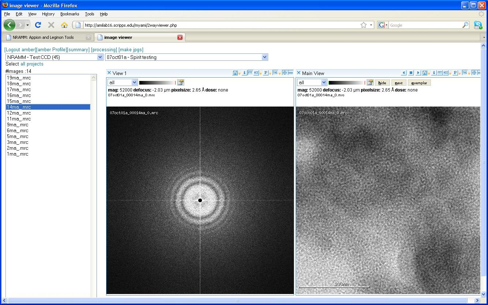

The **2 Way Viewer** allows you to view the selected image in two image view panes side by side. The following example shows the original mrc image next to its Fourier transform. For more details see [Image Viewer Overview](/appion/Appion_Manual/Appion_User_Guide/Appion_and_Leginon_Database_Tools/Image_Viewers/Common_Features).

**2 Way Viewer Screen:**

[< Image Viewer](/appion/Appion_Manual/Appion_User_Guide/Appion_and_Leginon_Database_Tools/Image_Viewers/Image_Viewer) | [3 Way Viewer >](/appion/Appion_Manual/Appion_User_Guide/Appion_and_Leginon_Database_Tools/Image_Viewers/3_Way_Viewer)
