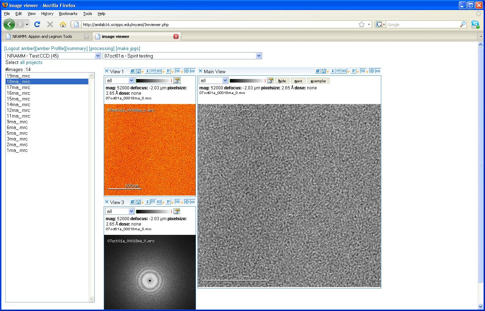

The **3 Way Viewer** allows you to view the selected image in 3 adjacent Image View panes. The following example shows the original mrc image along with a heat map view and Fourier transform. For more details see [Image Viewer Overview](/appion/Appion_Manual/Appion_User_Guide/Appion_and_Leginon_Database_Tools/Image_Viewers/Common_Features).

**3 Way Viewer Screen**

[< 2 Way Viewer](/appion/Appion_Manual/Appion_User_Guide/Appion_and_Leginon_Database_Tools/Image_Viewers/2_Way_Viewer) | [Dual Viewer >](/appion/Appion_Manual/Appion_User_Guide/Appion_and_Leginon_Database_Tools/Image_Viewers/Dual_Viewer)
