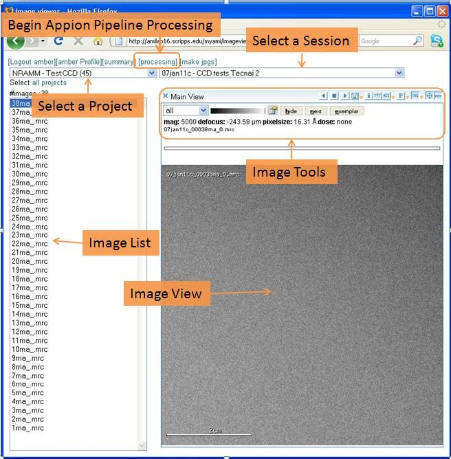
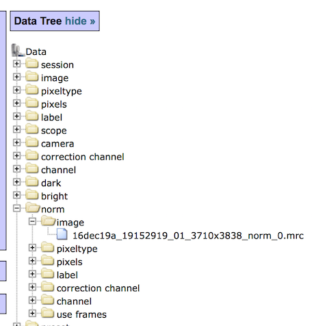
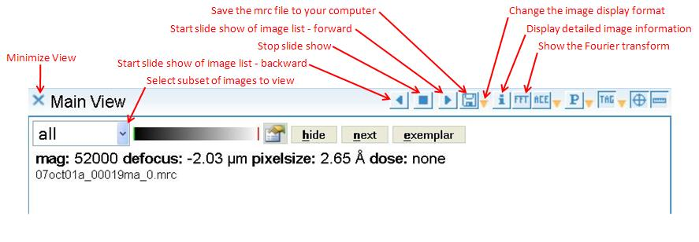
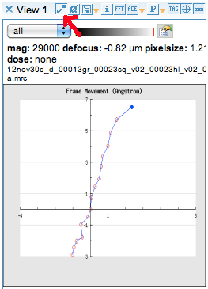

Image Viewers allow you to view the images that are associated with a particular session (or experiment). You may select a project from a drop down list, then select a session in that project. The images belonging to that session appear in an Image List and the selected image is displayed in the Image View.

## 1 Anatomy of an Image Viewer

**Primary Features:**
|*.Name|*.Description|
|Project Drop Down List| Projects that you own or have been shared will appear in the list. Select one to view.|
|Session Drop Down List|Sessions that belong to the currently selected Project will appear in the list. Select one to view.|
|Image List|The images belonging to the currently selected Session will appear in the Image List. The selected image will appear in the Image View. The total number of images is displayed at the top of the list.|
|Image View|The selected image will be displayed in the Image View. The Image View may be configured using the Image Tools controls located directly above the Image View.|
|Image Tools|Includes many basic image manipulation features such as filtering and Fourier Transform. |

**Image Viewer Screen:**

 

## 2 Features available with all viewers

### 2.1 From the header buttons

1.  View an aggregate summary of all the images in a session
2.  Launch the Appion Image processing application
3.  Launch a tool to create jpegs of all or many of the images in a session
     
    **Image Viewer Header Buttons:**
    

### 2.2 From the Image Tools panel

**Bottom row**

1.  Adjust image properties 
2.  Mark images as *hidden* or *exemplar*

**Top row**

1.  View a sideshow of the images in a session
2.  Download individual images in mrc, tiff or jpeg format
3.  View a detailed image report including mrc header information and calibrations and a comprehensive **data tree** to see all parameters about the image.
    
4.  View the Fourier Transform of the image
5.  View ACE graphs
6.  View Particle Picks
7.  View Leginon MSI focus and acquisition targets
8.  Overlay a scale ruler
     
    **Features of the Image Tools Panel:**
    

### 2.3 Dequeue Tool: 

Used to remove queued targets on the image shown in the viewer and queued targets chosen on its direct descendant images. Clicking on it gives the number of active queued targets and the user can choose to remove them from the active list.

### 2.4 Drift Graph Tool:

Used to show the feature drift in a movie from frame-saving DD camera. The blue dot marks the beginning of the movie. The unit is in Angstrom.
 This tool extract values from the frame alignment log of the selected aligned image.

## 3 Chose the right viewer for the job

**Image Viewer applications available in Appion and Leginon web tools:**
|*.Viewer Name|*.Viewer Features|
|[Image Viewer](/appion/Appion_Manual/Appion_User_Guide/Appion_and_Leginon_Database_Tools/Image_Viewers/Image_Viewer) | provides a single image pane|
|[2 Way Viewer](/appion/Appion_Manual/Appion_User_Guide/Appion_and_Leginon_Database_Tools/Image_Viewers/2_Way_Viewer) | provides 2 image panes for viewing the same mrc file in different ways side by side|
|[3 Way Viewer](/appion/Appion_Manual/Appion_User_Guide/Appion_and_Leginon_Database_Tools/Image_Viewers/3_Way_Viewer) | provides 3 image panes for viewing the same mrc file in different ways |
|[Dual Viewer](/appion/Appion_Manual/Appion_User_Guide/Appion_and_Leginon_Database_Tools/Image_Viewers/Dual_Viewer) | provides 2 image panes for viewing separate mrc images side by side|
|[RCT](/appion/RCT)| provides 2 images panes for viewing Random conical tilt image pairs|
|[Tomography Viewer](/appion/Tomography_Viewer)| provides summary of tilt series and tracking/prediction graph for Tomography images]|

[^ Image Viewers](/appion/Appion_Manual/Appion_User_Guide/Appion_and_Leginon_Database_Tools/Image_Viewers) | [Image Viewer >](/appion/Appion_Manual/Appion_User_Guide/Appion_and_Leginon_Database_Tools/Image_Viewers/Image_Viewer)
