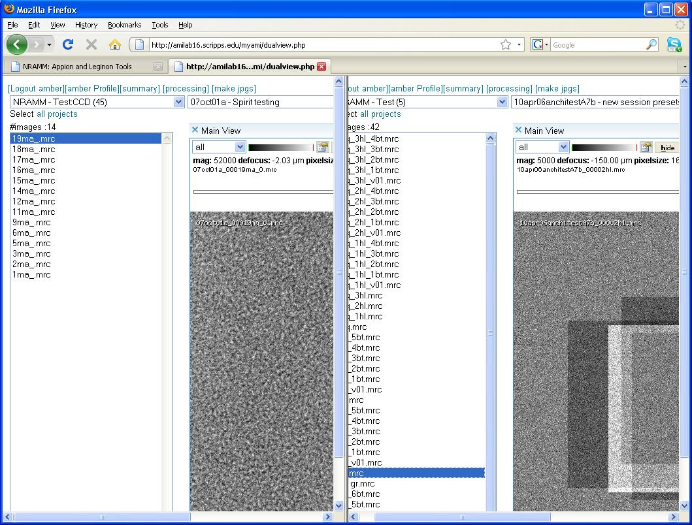

The **Dual Viewer** splits the browser window to allow two instances of the [Image Viewer](/appion/Appion_Manual/Appion_User_Guide/Appion_and_Leginon_Database_Tools/Image_Viewers/Image_Viewer) to appear side by side. The following example shows images from two different Projects being displayed side by side. For more details see [Image Viewer Overview](/appion/Appion_Manual/Appion_User_Guide/Appion_and_Leginon_Database_Tools/Image_Viewers/Common_Features).

**Dual Viewer Screen:**

[< 3 Way Viewer](/appion/Appion_Manual/Appion_User_Guide/Appion_and_Leginon_Database_Tools/Image_Viewers/3_Way_Viewer) | [RCT >](/appion/RCT)
