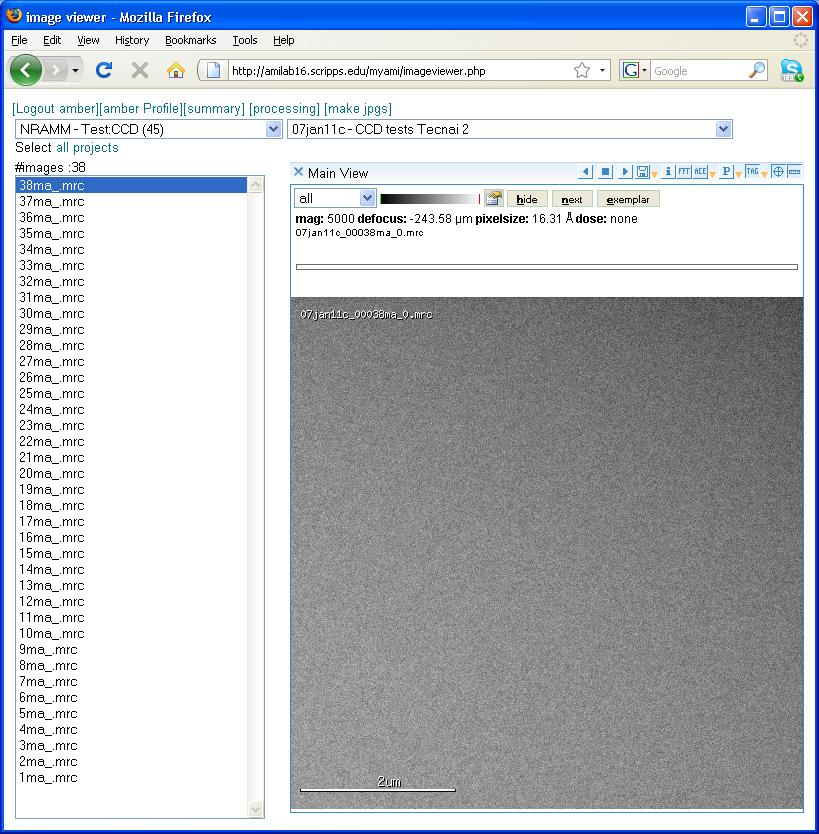

From the Appion and Leginon Tools start page, select **Image Viewer** to view images associated with your Project Sessions in a single viewing pane.
The following screen is displayed. For more details see [Image Viewer Overview](/appion/Appion_Manual/Appion_User_Guide/Appion_and_Leginon_Database_Tools/Image_Viewers/Common_Features).

**Image Viewer Screen:**

[< Image Viewer Overview](/appion/Appion_Manual/Appion_User_Guide/Appion_and_Leginon_Database_Tools/Image_Viewers/Common_Features) | [2 Way Viewer >](/appion/Appion_Manual/Appion_User_Guide/Appion_and_Leginon_Database_Tools/Image_Viewers/2_Way_Viewer)
