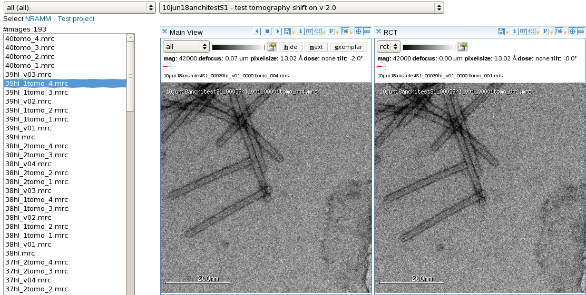

The RCT viewer is used for viewing random conical tilt (RCT) or orthogonal tilt reconstruction (OTR) pairs of images.

## Notes, Comments, and Suggestions:

1.  For examining particle selection results:
    -   Limit the images in the image list by changing the preset value drop down selection from *all* to *en* or otherwise appropriate preset value.
    -   Select an image from the image list and it will appear in the left side image viewer. It's tilted pair will appear on the right.
    -   Select the *P* (for picks) option on the image viewer menu bar. You can use the drop down arrow next to the *P* to select which picking run you would like to view.
    -   The particle picks from this run will be displayed on the images.

[< Dual Viewer](/appion/Appion_Manual/Appion_User_Guide/Appion_and_Leginon_Database_Tools/Image_Viewers/Dual_Viewer)
