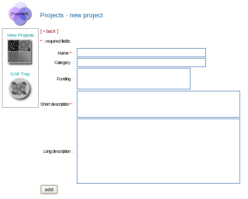

To create a new project:

1.  Click on the **Project DB** icon in the Appion and Leginon Tools start page or browse to http://YOUR_HOST/myamiweb/project/project.php.
2.  Click on the **Add a new project** link just above the project table.
3.  Enter at least a Name and Short Description of the project as well as other relevant fields.
4.  Click on the **add** button
     
    **New Project Screen**
    

[< View Projects](/appion/Appion_Manual/Appion_User_Guide/Appion_and_Leginon_Database_Tools/Project_DB/View_Projects) | [Edit Project Description >](/appion/Appion_Manual/Appion_User_Guide/Appion_and_Leginon_Database_Tools/Project_DB/Edit_Project_Description)
