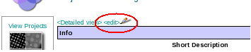

1.  Select the project DB tool from the Appion and Leginon Tools start page at http://YOUR_SERVER/myamiweb.
2.  Select the project you wish to edit by clicking on the project name.
3.  Select the **[edit>]{style="text-align:left;"}** button as shown below.
     
    **Edit Project Button**
    
     
4.  Modify the fields as desired and select the **Update** button.

[< Create New Project](/appion/Appion_Manual/Appion_User_Guide/Appion_and_Leginon_Database_Tools/Project_DB/Create_New_Project) | [Edit Project Owners >](/appion/Appion_Manual/Appion_User_Guide/Appion_and_Leginon_Database_Tools/Project_DB/Edit_Project_Owners)
