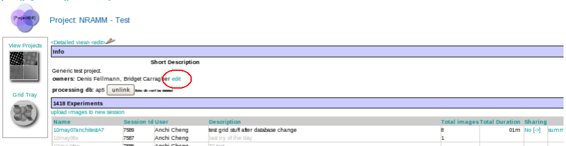
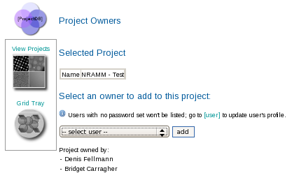

1.  Select the project DB tool from the Appion and Leginon Tools start page at http://YOUR_SERVER/myamiweb.
2.  Select the project you wish to edit by clicking on the project name.
3.  Under the Info section, locate the Owners: list and select the **edit** link.
     
    **Edit Owners Link**
    
     
4.  Use the drop down list to choose a user to add as an owner
5.  Click the **add** button
     
    

[< Edit Project Description](/appion/Appion_Manual/Appion_User_Guide/Appion_and_Leginon_Database_Tools/Project_DB/Edit_Project_Description) | [Create a Project Processing Database >](/appion/Appion_Manual/Appion_User_Guide/Appion_and_Leginon_Database_Tools/Project_DB/Create_a_Project_Processing_Database)
