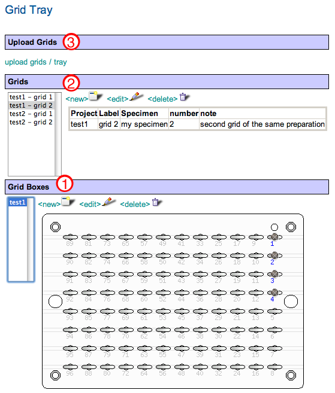

The grid management tools handle registration, modification, and deletion of grid boxes and grids. A grid registered in the database can be associated the images easily. Currently, the management tool is primarily used for grids to be handled by grid insertion/extraction robots coupled with Leginon's "Robot-MSI screen" applications. Apart from that, only "Manual" application has the interface for selecting grids from the database. Appion-only users can ignore this management tool.

This tool is located at http://your_myamiweb/project/gridtray.php

Grid registration starts with register a new grid box.

## 1. Grid Boxes

The grids are located in a grid box.

1.  Click on `<new> tab under the heading "Grid Box".
2.  Type an label unique to the database.
    **There are three types of grid boxes defined: 4 slot cryo grid box, typical 50 slot grid box, and 96 well robot grid tray**
3.  Select the type of grid box used.
4.  Click on "add" to register this grid box in the database.

## 2. Grids

# Click on `<new> tab under the heading "Grid" to register a new grid

-   Label needs to be unique to the project it belongs to and is a required field.
-   The specimen, preparation allows up to 100 characters. Since they are searchable, consistent definition of the field in the database is ideal.
-   Specimen field can be used to identify the protein or crystallization condition.
-   Preparation is usually used for define method of grid preparation such as the type of stain used.
-   Number is used to separate multiple grids made with the same specimen and preparation.
-   Notes field is a text field and can be longer than 100 characters.

After the grid is added, it can be assigned to a location on an existing grid box by choosing the box and click on a location not yet occupied by a grid.

## 3. Upload Grids

This allows the user to register multiple grids on the same grid box. This is most useful for a robot grid tray. Above rules for the grid fields still applies to the uploaded grids. In addition, only grids from the same project can be uploaded at one uploading grid file.

1.  Click on upload grid/tray
2.  Create grid file on local computer. The fields should be separated by tabs.
3.  Select the project with which the grids in the file is associated to.
4.  Type the grid box label to which the grids are inserted into. If the grid box does not exist, a new robot tray is created.
5.  Browse to choose the grid file and upload

[< View a Summary of a Project Session](/appion/Appion_Manual/Appion_User_Guide/Appion_and_Leginon_Database_Tools/Project_DB/View_a_Summary_of_a_Project_Session)
