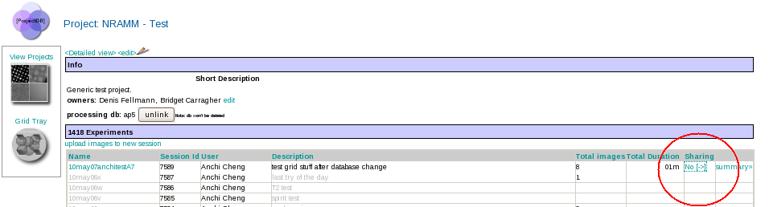
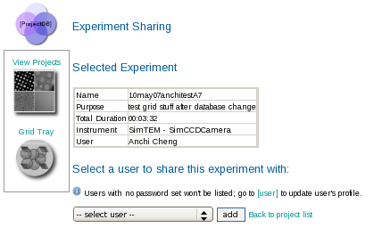

1.  Select the project DB tool from the Appion and Leginon Tools start page at http://YOUR_SERVER/myamiweb.
2.  Select the **Sharing** link next to your project in the experiment table
     
    **Sharing link**
    
     
3.  On the Experiment Sharing page, use the drop down list of users to select a person to share the experiment with
4.  Click the **add** button to share the experiment with the selected user
     
    **Experiment Sharing Page**
    

[< Upload Images to a new Project Session](/appion/Appion_Manual/Appion_User_Guide/Appion_and_Leginon_Database_Tools/Project_DB/Upload_Images_to_a_new_Project_Session) | [View a Summary of a Project Session >](/appion/Appion_Manual/Appion_User_Guide/Appion_and_Leginon_Database_Tools/Project_DB/View_a_Summary_of_a_Project_Session)
