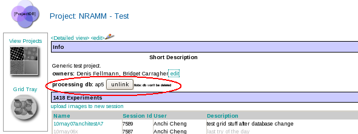

1.  Select the project DB tool from the Appion and Leginon Tools start page at http://YOUR_SERVER/myamiweb.
2.  Select your project by clicking on the project name.
3.  Click on the **unlink** button found in the info section next to **processing db:**
     
    **Unlink db button**
    
    > Unlinking a project and a database does **not** delete the database.

## Link a project to an existing db

To link to an existing db:

1.  Enter the db name
2.  Select **Create processing db**

[< Create a Project Processing Database](/appion/Appion_Manual/Appion_User_Guide/Appion_and_Leginon_Database_Tools/Project_DB/Create_a_Project_Processing_Database) | [Upload Images to a new Project Session >](/appion/Appion_Manual/Appion_User_Guide/Appion_and_Leginon_Database_Tools/Project_DB/Upload_Images_to_a_new_Project_Session)
