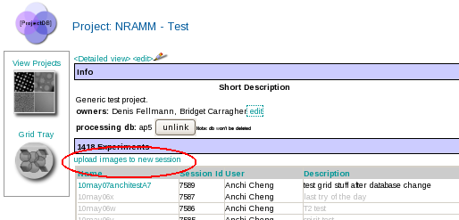

1.  Select the project DB tool from the Appion and Leginon Tools start page at http://YOUR_SERVER/myamiweb.
2.  Select your project by clicking on the project name.
3.  Under the Experiments section, select **Upload images to new session**.
     
    **Upload Images to new session button**
    
     
4.  Follow the instruction provided in mouse-over tool tips.
     
    **Upload Images Screen**
    

## Image Grouping

### Defocal pair (Webform parameter entry only)

The user will need to make sure the files are organized alphabetically sorted by the group first
For example, image1.mrc=location1/defocus1, image2.mrc=location1/defocus2, image3=location2/defocus1, image4=location2/defocus2 etc.

### RCT tilt pair or defocal pair (Both methods available)

When using webform parameter entry method, the user will need to make sure the files are organized alphabetically sorted by the group first
For example, image1.mrc=location1/tilt1, image2.mrc=location1/tilt2, image3=location2/tilt1, image4=location2/tilt2 etc.

See [Image pair upload for rct](/appion/Appion_Manual/Appion_User_Guide/Appion_and_Leginon_Database_Tools/Project_DB/Upload_Images_to_a_new_Project_Session/Image_pair_upload_for_rct) for more details

### Tomography tilt series (Parameter File method only)

The file entry should be ordered by the tilt series. It is possible to upload a bi-directional (0 to positive tilts and then 0 to negative tilts, for example) tilt series.
Number of images in the tilt group defines the tilt series.

## Tips

### Change the cs value associated with an uploaded session

The cs value that you enter during upload should be the correct value for the scope that the images were collected on. It is highly recommended that you make an effort to discover this value prior to uploading images to Appion. If you have uploaded images with the incorrect cs value, a system administrator with access to the Appion and Leginon databases can assist with changing the cs value associated with your images.

These are the steps that need to be done to change the cs value. (Applies to version 2.2 and later)

1.  Note the session Id that you wish to change
2.  go to the leginon database (ex. dbemdata)
3.  go to the InstrumentData table and see if there is an instrument called AppionTEM with a cs value that is the same as the cs value you wish to change to. If it exists, note the DefId, if not, add one with the correct cs value and note its defId.
4.  Go to ScopeEMdata table and search for the session that you wish to change.
5.  Modify the REF|InstrumentData|TEM for that session with the defId of the AppionTEM with the correct cs value.
6.  Go to pixelSizeCalibrationData table and search for the session.
7.  Edit this entry and turn off the option to update the timestamp to the current time. **Make sure the timestamp is not changed when editing this table.** Update REF|InstrumentData|TEM with the defId of the correct TEM.

[< Unlink a Project Processing Database](/appion/Appion_Manual/Appion_User_Guide/Appion_and_Leginon_Database_Tools/Project_DB/Unlink_a_Project_Processing_Database) | [Share a Project Session with another User >](/appion/Appion_Manual/Appion_User_Guide/Appion_and_Leginon_Database_Tools/Project_DB/Share_a_Project_Session_with_another_User)
