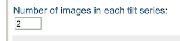

In order to associate the images as tilt pairs, the files need to b uploaded in a specific way as follows.

## Name the files so that the two tilts are next to each other after a filename alphabetical sort.

For example,

  ------------ ---------- --------
  image1.mrc   series 1   tilt 1
  image2.mrc   series 1   tilt 2
  image3.mrc   series 2   tilt 1
  image4.mrc   series 2   tilt 2
  ------------ ---------- --------

## Follow [Upload Images to a new Project Session](/appion/Appion_Manual/Appion_User_Guide/Appion_and_Leginon_Database_Tools/Project_DB/Upload_Images_to_a_new_Project_Session) to open the interface for image upload

but use the following instruction for the specific parameters involved.

Enter tilts in degrees

## Successful upload should be viewable as pairs in [RCT viewer](/appion/Appion_Manual/Appion_User_Guide/Appion_and_Leginon_Database_Tools/Image_Viewers/RCT_viewer)
