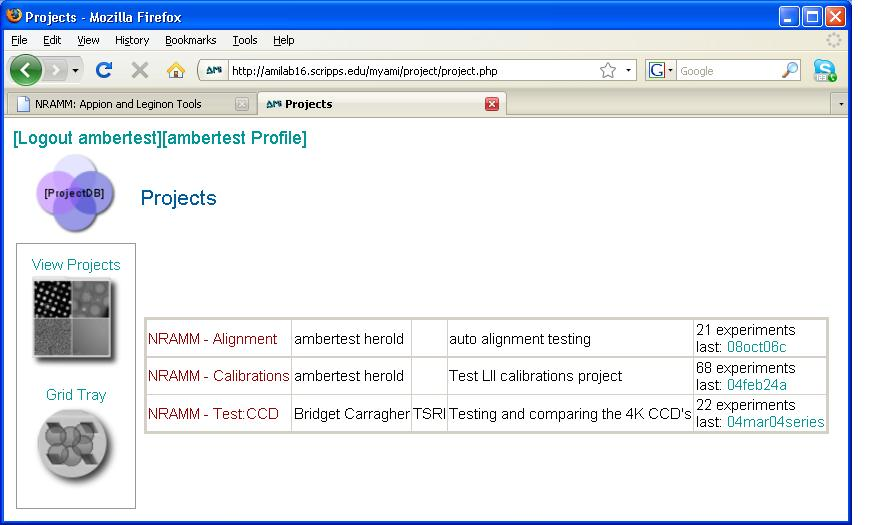
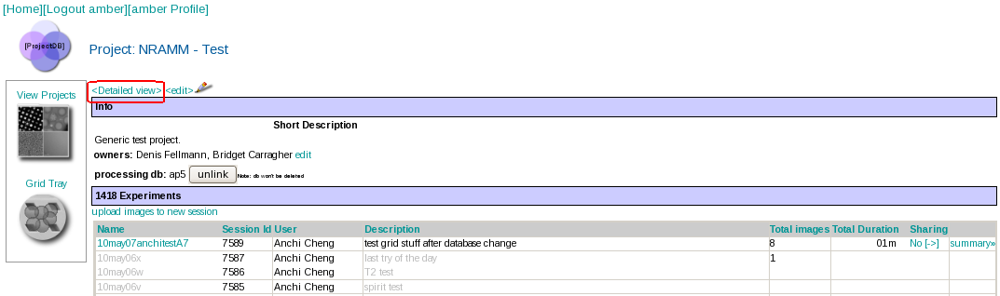

To view a list of the Projects that you have permission to access:

1.  Click on the **Project DB** icon in the Appion and Leginon Tools start page or browse to http://YOUR_HOST/myamiweb/project/project.php.
2.  The following screen will be displayed:
     
    **Projects Screen**
    
     
3.  Click on the name of the project you wish to view
4.  A **simple view** of the project will be displayed:
     
    
     
5.  To see more information about the project, click the **[Detailed View>]{style="text-align:left;"}** button shown above
     

[Create New Project >](/appion/Appion_Manual/Appion_User_Guide/Appion_and_Leginon_Database_Tools/Project_DB/Create_New_Project)
