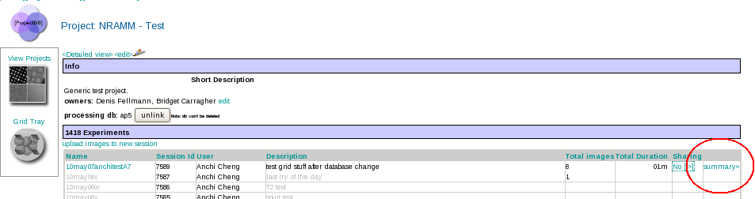

1.  Select the project DB tool from the Appion and Leginon Tools start page at http://YOUR_SERVER/myamiweb.
2.  Select the **Summary** link next to your project in the experiment table to display session detatils
     
    **Session Summary link**
    
     

[< Share a Project Session with another User](/appion/Appion_Manual/Appion_User_Guide/Appion_and_Leginon_Database_Tools/Project_DB/Share_a_Project_Session_with_another_User) | [Grid Management >](/appion/Appion_Manual/Appion_User_Guide/Appion_and_Leginon_Database_Tools/Project_DB/Grid_Management)
