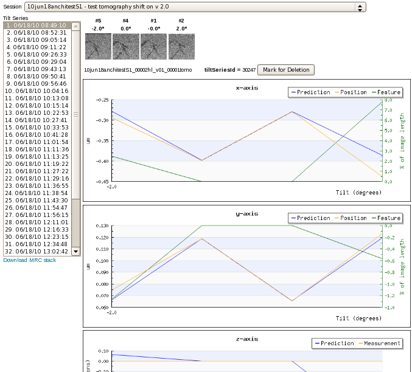

For information about Tomography, see [Tomography](http://emg.nysbc.org/documentation/leginon/bk01ch12s03.php#Tomo_undestand_model).

[< LOI](/appion/Appion_Manual/Appion_User_Guide/Appion_and_Leginon_Database_Tools/LOI_-_Leginon_Observer_Interface) | [Hole Template Viewer >](/appion/Appion_Manual/Appion_User_Guide/Appion_and_Leginon_Database_Tools/Hole_Template_Viewer)
