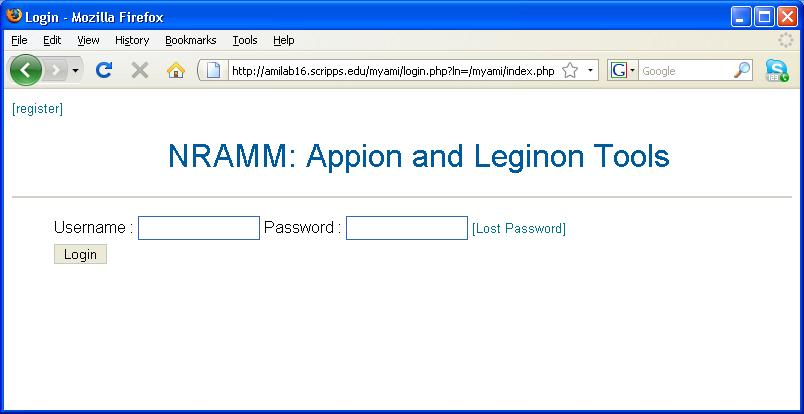

To enable or disable user authentication, run the setup wizard at http://YOUR_SERVER/myamiweb/setup or modify config.php in myamiweb.

If Appion/Leginon is configured to enable user authentication, the myamiweb user interface will allow users to:

1.  login only with a valid username and password
2.  modify their profile
3.  log out
4.  log in as an anonymous guest for viewing public data sets (version 2.1.0)

Adding new user is now only allowed by an user within Administrators group.

When a user points a browser to http://YOUR_SERVER/myamiweb, the following login screen is displayed:

**Myamiweb Login Screen**

[New User Registration >](/appion/Appion_Manual/Appion_User_Guide/Appion_and_Leginon_Database_Tools/User_Management/New_User_Registration)
