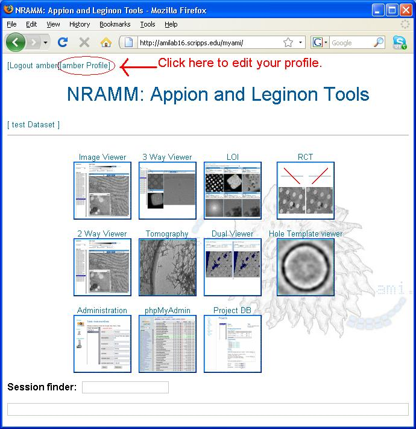
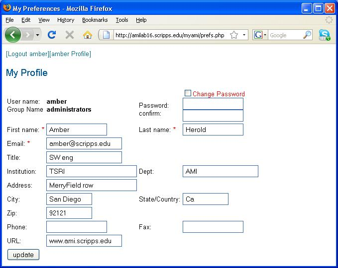

Once you have successfully logged into the system, you may edit your profile:

1.  click on the **[]{lang="Profile"}** button in the top left corner of the Appion and Leginon Tools start page as shown below:
     
    
     
2.  edit your information as shown in the following **My Profile** screen
3.  When changing your password, check the box that says **Change Password**.
4.  Press the **Update** button
     
    **My Profile**
    

[< Retrieve Forgotten Password](/appion/Appion_Manual/Appion_User_Guide/Appion_and_Leginon_Database_Tools/User_Management/Retrieve_Forgotten_Password) | [Logout >](/appion/Appion_Manual/Appion_User_Guide/Appion_and_Leginon_Database_Tools/User_Management/Logout)
