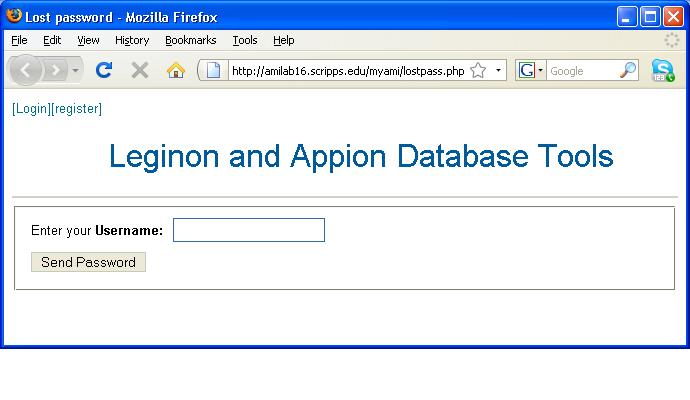

To reset a lost password:

1.  Press the **[Lost Password]** button on the Login Screen.
2.  Enter the username that you registered with
3.  Press the **Send Password** button
     
    An email will be sent to you with a new temporary password.
     
4.  After logging in to the system, change your password by [editing your user profile](/appion/Appion_Manual/Appion_User_Guide/Appion_and_Leginon_Database_Tools/User_Management/Modify_Your_Profile)

**Lost Password Screen**

[< New User Registration](/appion/Appion_Manual/Appion_User_Guide/Appion_and_Leginon_Database_Tools/User_Management/New_User_Registration) | [Modify Your Profile >](/appion/Appion_Manual/Appion_User_Guide/Appion_and_Leginon_Database_Tools/User_Management/Modify_Your_Profile)

_
