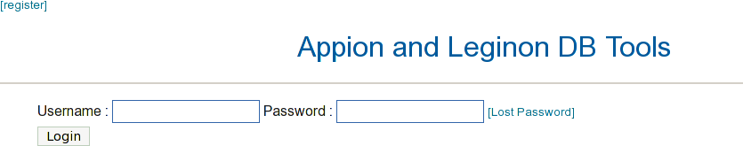
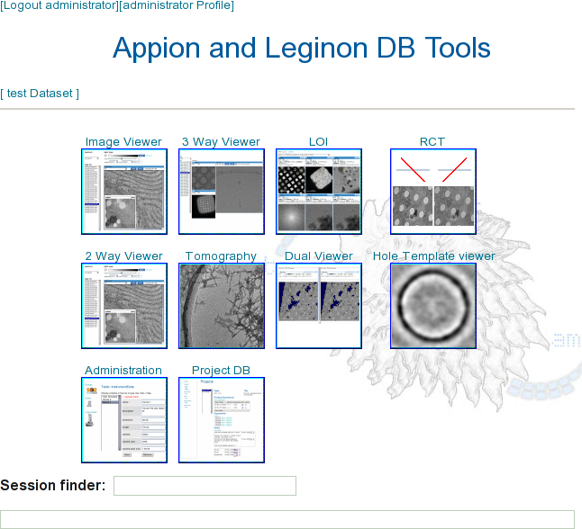

[TOC]

Use the following guidelines for creating your first Appion project.

## 1 Go to the main web page

The url will vary based on your host name.

http://localhost/myamiweb/

## 2 Log into myamiweb

With the username "administrator" and the administrator password created in the wizard, log into myamiweb as shown below.
If you did not enable user login in the setup wizard, you will not be prompted for a password.

_

_

.
.
.
You will then see the default layout for the administrator.
.
.
.

_

_

## 3 Add yourself as a user

1.  Select the Administration application.
2.  Select Users
3.  Select Add new user
4.  Complete the new user form
5.  There are four default groups available. You may also [create a new group](/appion/Appion_Manual/Appion_User_Guide/Appion_and_Leginon_Database_Tools/Administration/Groups).
    1.  administrators
    2.  power users
    3.  users
    4.  guests
6.  Click on [add].

More about [Users](/appion/Appion_Manual/Appion_User_Guide/Appion_and_Leginon_Database_Tools/Administration/Users).

## 4 Create a project

1.  From the start page, select the ProjectDB application.
2.  Select "Add a new project"
3.  Complete the form
4.  Click on [add]
5.  Click "View Projects" to see your newly created project
6.  Select your new project to view it

## 5 Create the processing database for the project

Follow the instructions in [Create a Processing Database](/appion/Appion_Manual/Complete_Installation/Create_a_Test_Project/Create_a_Processing_Database). This will hold all the Appion processing data for your project.

## 6 Upload images to a new session

You can download sample images from [here](http://emg.nysbc.org/redmine/projects/appion/files).
Then follow the steps in [Upload Images](/appion/Appion_Manual/Appion_User_Guide/Appion_and_Leginon_Database_Tools/Project_DB/Upload_Images_to_a_new_Project_Session).
You can use Pixel size of .83, binning of 1, magnification 100,00, high tension 120, defocus --0.89.

## 7 View the images

Once your images have been uploaded to a session, you can view them in the Image Viewer application.

1.  Return to ProjectDB and select your project
2.  Sessions are listed in a table, select the session that you just created.
3.  The image viewer will open with the first image in your session displayed.

## 8 Process Images

From the image viewer, click on the [processing] button at the top of the screen. This will open the Appion processing pipeline application.
From there, follow the directions in [Process Images](/appion/Appion_Manual/Complete_Installation/Create_a_Test_Project/Process_Images) to confirm that your installation is functioning properly.

[< Setup Remote Processing](/appion/Appion_Manual/Complete_Installation/Setup_Remote_Processing)
