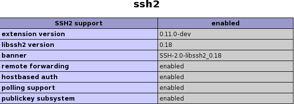

This installation occurs on the web server.

## The ssh2 extension for php

If you have not already done so, install the following prerequisites:

Name: Download site: CentOS yum package name Fedora yum package name SuSE rpm name
------------------------------ ------------------------------------------------------------------------------ ------------------------------------------------------ ------------------------------------- ----------------------
php devel http://www.php.net php-devel php-devel
libssh2 devel http://www.libssh2.org libssh2-devel (found in epel repo) libssh2-devel
SSH PECL extension http://www.php.net/manual/en/ssh2.installation.php php-pecl-ssh2 php-pecl-ssh2

sudo yum install php-pecl-ssh2 php-devel libssh2-devel

## Test that the module is working:

1. go to the info.php that was created earlier in the [Install the MRC PHP Extension](/appion/Appion_Manual/Complete_Installation/Web_Server_Installation/Install_the_MRC_PHP_Extension), http://localhost/info.php or http://HOST.INSTITUTE.EDU/info.php
2. search for the ssh2 module, you should see this section:

## Still having problems?

1. on one machine restarting httpd was not enough, I had to restart the entire system to get it working (even though it shows up under info.php)

[< Check PHP information](/appion/Appion_Manual/Complete_Installation/Web_Server_Installation/Check_php_information) | [Download Appion and Leginon Files >](/appion/Appion_Manual/Complete_Installation/Web_Server_Installation/Download_Appion_and_Leginon_Files)
