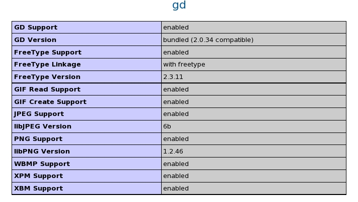
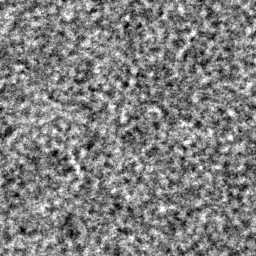

MRC Tools is installed as a php extension and is required for displaying mrc files live on the web browser.

**Note:** The MRC PHP Extension is not compatible with PHP 5.3 and greater. For this reason, Appion/Leginon version 3.0 and greater no longer require the MRC PHP extension. Appion/Leginon versions older than 3.0 still require the MRC PHP extension as well as a PHP 5.2.x.

## Make sure you have installed the prerequisite packages

You may find installation information for the following packages under [Install Web Server Prerequisites](/appion/Appion_Manual/Complete_Installation/Web_Server_Installation/Install_Web_Server_Prerequisites).

### php-devel

You can check whether php-devel is installed by typing:

    phpize

Do not worry about any error message as long as the command is found.
 

### php-GD/FFTW3-devel

Make sure that php-GD and FFTW 3 devel libraries are installed. Visit or refresh http://yourhost/info.php which you created earlier. It should have a section looking like this:

**Note:**
MRCtools are compiled and added to php extension with php-devel package. MRCtools use GD and FFTW3 that need to be compiled from their development libraries while the extension is compiled. If GD and FFTW3 sources were downloaded and compiled directly on your computer, these development files are included. If (as in most cases) GD and FFTW3 are installed from rpm, they are not included. An error message will appear when you attempt to compile mrctools. In this case, you will need separate download and installation of GD-devel and FFTW3-devel. Search http://rpmfind.net/linux/rpm2html/ for GD-devel and FFTW3-devel for the rpm distribution needed for your system. More information on the gd library can be found [here](http://www.php.net/manual/en/image.requirements.php). If you find that you can only view images as png instead of jpg, it may be that you do not have gd *jpeg* support installed.

## MRC Tools Installation

# Go to the myami/programs/php_mrc directory

    cd myami/programs/php_mrc

# Compile and install the MRC module

    phpize
    ./configure 
    make
    sudo make install

 

# Check that the mrc.so module exists in your php module directory
 
(e.g., `/usr/lib64/php/modules` on 64bit CentOS/RHEL/Fedora). If you are unsure where the php module directory is, use http://localhost/info.php to find it under **extension_dir**.
 

    ls /usr/lib64/php/modules
      mrc.so

For Suse

    ls /usr/lib64/php5/extensions
      mrc.so

# Edit your php configuration file, `php.ini`.
 
If your linux distro does not have a /etc/php.d/ or /etc/php.d/conf.d/ directory where other .ini files reside, you may need to follow the alternate instructions below titled: *Alternative approach if mrc module does not show up in info.php output*.
 

Confirm the location of "additional .ini files parsed" from the info.php web page (/etc/php.d in this example)
and create a file called "mrc.ini" in this directory. This may be done with the following series of commands:

    cd /etc/php.d
    sudo touch /etc/php.d/mrc.ini
    sudo chmod 666 mrc.ini
    echo "; Enable mrc extension module" > mrc.ini
    echo "extension=mrc.so" >> mrc.ini
    sudo chmod 444 mrc.ini
    cat mrc.ini

 
**OR** as an alternative to the above directions:
 

Add the "mrc.so" extension to the end of the **extension section**

    extension=mrc.so

 

# Restart your webserver
 
Example commands:

    #SuSe
    /etc/init.d/apache2 restart 
    &nbsp;
    #CentOS
    sudo /sbin/service httpd restart 

 
**Note:** Sometimes, the MRC module will not work even after restarting the webserver. Try restarting the whole computer:

    sudo reboot

 

1.  Verify the mrc tools installation
     
    Visit or refresh http://yourhost/info.php which you created earlier. It should have a section looking like this (The version should correspond to what you've just installed):
     
    
     
    If mrc is not listed, the extension did not get added in the right order.

### Alternative approach if mrc module does not show up in info.php output

1. find in the info.php web page the location of "additional .ini files parsed" in the first table (such as /etc/php.d/conf.d/*).

2. Go to the directory and make a copy of any ini file to use as a template for mrc.ini

          >cd [additional_ini_directory]
          >cp gd.ini mrc.ini

3. Edit mrc.ini to the following

          ; comment out next line to disable mrc extension in php
          extension=mrc.so

4. Comment out mrc extension from php.ini (found in /etc/php.ini/ on a typical PHP installation)

          ;extension=mrc.so

5. Restart your webserver

          > /etc/init.d/httpd restart

#### Test the MRC module installation

In the myami/php_mrc (or myami/programs/php_mrc if installing from trunk) directory, you will find two test scripts, "ex1.php" and "ex2.php" and a test MRC image "mymrc.mrc".

Copy them to your top level web directory (for example on CentOS: /var/www/html/):

    cd myami/programs/php_mrc
    sudo cp ex1.php ex2.php mymrc.mrc /var/www/html/

Run the scripts with the following commands and visit the corresponding pages from the web server:
The expected results are shown below. If you get the same images, you've installed the extension properly.
Note: the "display" command is part of the ImageMagick package, which you may have to install.

web server: http://localhost/ex1.php

    php -q ex1.php | display

-   gd module test result:
    

web server: http://localhost/ex2.php

    php -q ex2.php | display

-   fftw module test result:
    

Test files work but images not showing up in the ImageViewers?
[Here's one way this was fixed.](/appion/appionTroubleshooting_Notes)

[< Download Appion and Leginon Files](/appion/Appion_Manual/Complete_Installation/Web_Server_Installation/Download_Appion_and_Leginon_Files) | [Install SSH module for PHP >](/appion/Appion_Manual/Complete_Installation/Web_Server_Installation/Install_SSH_module_for_PHP_webserver)
