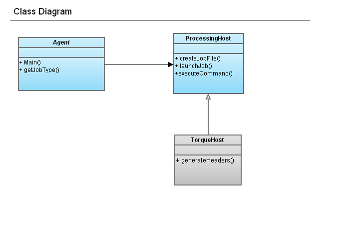

### How a cluster job file is built and launched

* To run a cluster job, the user runs a command on the head node of the cluster that looks like this:

    runJob.py --jobtype=frealignrecon --outerMaskRadius=65 --innerMaskRadius=0 --symmetry="D7 (z)" --endIter=10 --percentDiscard=15 --wgh=0.07 --hp=300 --lp=10 --ffilt --psi --theta --phi --x --y --modelnames=initmodel0001.mrc --stackname=start.mrc --apix=1.63 --boxsize=120 --totalpart=300 --cs=2 --kv=120 --description="test frealign get preset" --runname=frealign_recon69 --rundir=/ami/data17/appion/zz07jul25b/recon/frealign_recon69 --nodes=2 --ppn=4 --rpn=8 --walltime=240 --cput=2400 --localhost=guppy.scripps.edu --remoterundir=/ami/data15/appion/zz07jul25b/recon/frealign_recon69 --projectid=303 --expid=8556

* **runJob.py** (source:trunk/appion/bin/runJob.py) is a python script that passes all the command parameters to a python class called **apAgent** (source:trunk/appion/appionlib/apAgent.py).
The **apAgent** object instantiates 2 more classes:

1.  *Job object*:
    -   this can be a **genericJob** (source:trunk/appion/appionlib/apGenericJob.py) which does not require a specialized job file, or a job class based on **apRefineJob**, or **apRemoteJob**
    -   See source:trunk/appion/appionlib/apSparxISAC.py for an example based on remoteJob
    -   The job object is passed the cluster processing parameters and the name of the job
    -   Most importantly, this object is responsible for knowing what the guts of the job file should be. These guts are maintained in a list called **command_list**
2.  *Processing Host object*:
    -   The base processing host will work for most resource managers, variations can create a new class based on processingHost.py (source:trunk/appion/appionlib/processingHost.py) such as source:trunk/appion/appionlib/torqueHost.py
    -   The processing host class knows how to format the job file so that the resource manager running on the current cluster can read it
    -   It also keeps track of the correct commands to use to launch a job and check on the job status

-   So, when a job is run with a command starting with runJob.py:
    1.  an apAgent object will be created
    2.  the apAgent object will create a processingHost object whose type (torque, moab, etc) depends on the specific cluster that is being run on
    3.  the apAgent object will create a job object based on the ---jobtype parameter that was passed to runJob.py
    4.  the apAgent object will then call the launchJob() function defined in the processingHost class
    5.  inside the launchJob() function, the details of the job cluster parameters (number of processors, memory, etc) and the guts of the job file are requested from the Job Object
    6.  the information from the job object is used by the processingHost object to build the job file
    7.  the processingHost object submits the newly created job file to the cluster

### To add a new job type

1.  Write a new class in myami/appion/appionLib that is based on apRefineJob or apRemoteJob
     
2.  Add the new job type to the Agent class
     
    After you have added a new refinement job class it needs to be added to the job running agent by editing the file apAgent.py in appionlib.
     
    1.  Add the name of the module you created to the import statements at the top of the file.
    2.  In the method *createJobInst* add the new refinment job type to the condition statements.
              Ex.
              elif "newJobType" == jobType:
                        jobInstance = newModuleName.NewRefinementClass(command)

