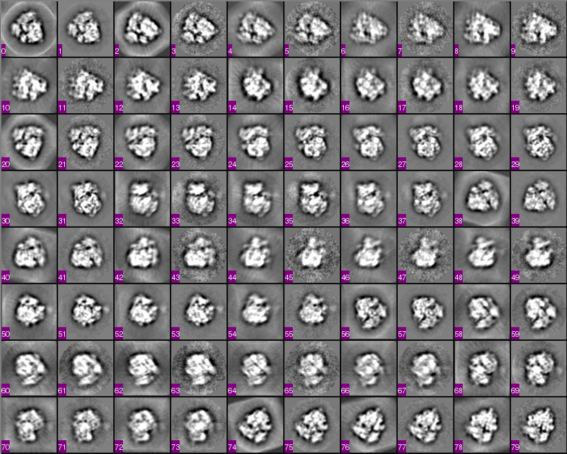

## database architecture for refinement methods

The current database scheme for every refinement method (both single-model and multi-model) is shown below:

[database architecture for refinements](http://emg.nysbc.org/redmine/attachments/955/database_scheme_diagram.pdf)

For reference, below is a diagram of the modifications to the refinement pipeline that have been performed for the refactoring. Color coding is as follows:

[changes to the database architecture for refinements](http://emg.nysbc.org/redmine/attachments/954/database_scheme_diagram_changes.pdf)

-   all previous database tables / pointers that have remained unchanged during refactoring are blue.
-   database tables that are completely new are outlined AND filled in red
-   database tables that have existed, but are modified are outlined in red, filled in white. The new additions are highlighted
-   new pointers to other database tables are red; unmodified pointers are blue
-   pointers to other database tables are all combined under "REFS"; if "REFS" is highlighted, this means that new pointers have been added

## How to add a new refinement

# determine the name of the new table in the database. In most cases, this will only be called "ApYourPackageRefineIterData." Unless there are specific parameters for each particle that you would like to save, this should probably contain all of your package-specific parameters.

# write a refinement preparation script in python (see example below).

* write the refinement job creation script in python.

1.  write an upload script in python (see example below). Another option would be to have a script that converts your parameters into Appion / 3DEM format (see below), then upload as an external package (see below).

## What's being done in the background

the ReconUploader base class takes care of a many different functions, specifically:

-   general error-checking
-   untarring results and creating necessary directories
-   querying database for stack / model parameters
-   reading .pickle file for run parameters or, if absent, calling a package-specific parameter parsing function (should be in the uploadYourPackageRefine.py script)
-   reading particle data file (the general .txt file that contains all particle parameters)
-   determining which iterations can / should be uploaded
-   inserting all data associated with refinement tables, including the package-specific parameters; the latter is defined in the subclass.
-   creates metadata associated with parameters (e.g. Euler plots, Euler jumper calculations, FSC insertions, etc.)
-   verifies the number of inserted iterations

## Write refinement preparation script in python

-   In /myami/appion/bin create a new python module with a name starting with prepRefine and define in your module a subclass of Prep3DRefinement found in appionlib/apPrepRefine.py . An working example is in myami/appion/bin/PrepRefine.py. You may copy that as a start.
-   Required function definitions are: setRefineMethod(), setFormat(), addStackToSend(), and add ModelToSend(). Please see the base class code for what variables they take.
-   If there are options that need to be defined for the refinement method that is not in the base class, you may redefine setupParserOptions(). See /myami/appion/bin/prepRefineFrealign.py for an example of this.

## Write refinement job script in python

-   In /myami/appion/appionlib, create a new module with a name starting with apRefineJob and define in your module a subclass of RefineJob found in appionlib/apRefineJob.py. An working example is in myami/appion/appionlib/apRefineJobEman.py and apRefineJobFrealign.py (MPI setup used).
-   For testing, use /myami/appion/bin/testRefine.py in place of runJob.py when construction the appion script command with all options. When thie script runs successfully, it only print out the list of the commands without doing any real job creation and running.

### Add job type to Agent.

After you have added the new refinement methods job class it needs to be added to the job running agent by editting the file apAgent.py in appionlib.

1.  Add the name of the module you created to the import statements at the top of the file.
2.  In the method *createJobInst* add the new refinment job type to the condition statements.
          Ex.
          elif "newJobType" == jobType:
                    jobInstance = newModuleName.NewRefinementClass(command)

## Upload refinement script in python

The script should be titled 'uploadYourPackageRefine.py'

This script performs all of the basic operations that are needed to upload a refinement to the database, such that it can be displayed in AppionWeb. The bulk of the job is performed with the ReconUploader.py base class, which is inherited by each new uploadYourPackageRefine.py subclass script. this means that the developer's job is simply to make sure that all of the particle / package parameters are being passed in a specific format. Effectively, the only things that need to be written to this script are:

1.  define the basic operations that will be performed: this will setup basic package parameters and call on converter functions. The simplest case is the external refinement package uploader, in which case only the general refinement parameters are uploaded to the database:

    def __init__(self):
        ### DEFINE THE NAME OF THE PACKAGE
        self.package = "external_package"
        super(uploadExternalPackageScript, self).__init__()

    #=====================
    def start(self):

        ### determine which iterations to upload; last iter is defaulted to infinity
        uploadIterations = self.verifyUploadIterations()                

        ### upload each iteration
        for iteration in uploadIterations:
            for j in range(self.runparams['numberOfReferences']):

                ### general error checking, these are the minimum files that are needed
                vol = os.path.join(self.resultspath, "recon_%s_it%.3d_vol%.3d.mrc" % (self.params['timestamp'], iteration, j+1))
                particledatafile = os.path.join(self.resultspath, "particle_data_%s_it%.3d_vol%.3d.txt" % (self.params['timestamp'], iteration, j+1))
                if not os.path.isfile(vol):
                    apDisplay.printError("you must have an mrc volume file in the 'external_package_results' directory")
                if not os.path.isfile(particledatafile):
                    apDisplay.printError("you must have a particle data file in the 'external_package_results' directory")                                      

                ### make chimera snapshot of volume
                self.createChimeraVolumeSnapshot(vol, iteration, j+1)

                ### instantiate database objects
                self.insertRefinementRunData(iteration, j+1)
                self.insertRefinementIterationData(iteration, j+1)

        ### calculate Euler jumps
        self.calculateEulerJumpsAndGoodBadParticles(uploadIterations)

In the single-model refinement case (example Xmipp projection-matching):

    def __init__(self):
        ### DEFINE THE NAME OF THE PACKAGE
        self.package = "Xmipp"
        self.multiModelRefinementRun = False
        super(uploadXmippProjectionMatchingRefinementScript, self).__init__()

    def start(self):

        ### database entry parameters
        package_table = 'ApXmippRefineIterData|xmippParams'

        ### set projection-matching path
        self.projmatchpath = os.path.abspath(os.path.join(self.params['rundir'], self.runparams['package_params']['WorkingDir']))

        ### check for variable root directories between file systems
        apXmipp.checkSelOrDocFileRootDirectoryInDirectoryTree(self.params['rundir'], self.runparams['cluster_root_path'], self.runparams['upload_root_path'])

        ### determine which iterations to upload
        lastiter = self.findLastCompletedIteration()
        uploadIterations = self.verifyUploadIterations(lastiter)    

        ### upload each iteration
        for iteration in uploadIterations:

            apDisplay.printColor("uploading iteration %d" % iteration, "cyan")

            ### set package parameters, as they will appear in database entries
            package_database_object = self.instantiateProjMatchParamsData(iteration)

            ### move FSC file to results directory
            oldfscfile = os.path.join(self.projmatchpath, "Iter_%d" % iteration, "Iter_%d_resolution.fsc" % iteration)
            newfscfile = os.path.join(self.resultspath, "recon_%s_it%.3d_vol001.fsc" % (self.params['timestamp'],iteration))
            if os.path.exists(oldfscfile):
                shutil.copyfile(oldfscfile, newfscfile)

            ### create a stack of class averages and reprojections (optional)
            self.compute_stack_of_class_averages_and_reprojections(iteration)

            ### create a text file with particle information
            self.createParticleDataFile(iteration)

            ### create mrc file of map for iteration and reference number
            oldvol = os.path.join(self.projmatchpath, "Iter_%d" % iteration, "Iter_%d_reconstruction.vol" % iteration)
            newvol = os.path.join(self.resultspath, "recon_%s_it%.3d_vol001.mrc" % (self.params['timestamp'], iteration))
            mrccmd = "proc3d %s %s apix=%.3f" % (oldvol, newvol, self.runparams['apix'])
            apParam.runCmd(mrccmd, "EMAN")

            ### make chimera snapshot of volume
            self.createChimeraVolumeSnapshot(newvol, iteration)

            ### instantiate database objects
            self.insertRefinementRunData(iteration)
            self.insertRefinementIterationData(package_table, package_database_object, iteration)

        ### calculate Euler jumps
        self.calculateEulerJumpsAndGoodBadParticles(uploadIterations)   

        ### query the database for the completed refinements BEFORE deleting any files ... returns a dictionary of lists
        ### e.g. {1: [5, 4, 3, 2, 1]} means 5 iters completed for refine 1
        complete_refinements = self.verifyNumberOfCompletedRefinements(multiModelRefinementRun=False)
        if self.params['cleanup_files'] is True:
            self.cleanupFiles(complete_refinements)

in the multi-model refinement case (example Xmipp ML3D):

    def __init__(self):
        ### DEFINE THE NAME OF THE PACKAGE
        self.package = "XmippML3D"
        self.multiModelRefinementRun = True
        super(uploadXmippML3DScript, self).__init__()

    def start(self):

        ### database entry parameters
        package_table = 'ApXmippML3DRefineIterData|xmippML3DParams'

        ### set ml3d path
        self.ml3dpath = os.path.abspath(os.path.join(self.params['rundir'], self.runparams['package_params']['WorkingDir'], "RunML3D"))

        ### check for variable root directories between file systems
        apXmipp.checkSelOrDocFileRootDirectoryInDirectoryTree(self.params['rundir'], self.runparams['cluster_root_path'], self.runparams['upload_root_path'])

        ### determine which iterations to upload
        lastiter = self.findLastCompletedIteration()
        uploadIterations = self.verifyUploadIterations(lastiter)                

        ### create ml3d_lib.doc file somewhat of a workaround, but necessary to make projections
        total_num_2d_classes = self.createModifiedLibFile()

        ### upload each iteration
        for iteration in uploadIterations:

            ### set package parameters, as they will appear in database entries
            package_database_object = self.instantiateML3DParamsData(iteration)

            for j in range(self.runparams['package_params']['NumberOfReferences']):

                ### calculate FSC for each iteration using split selfile (selfile requires root directory change)
                self.calculateFSCforIteration(iteration, j+1)

                ### create a stack of class averages and reprojections (optional)
                self.compute_stack_of_class_averages_and_reprojections(iteration, j+1)

                ### create a text file with particle information
                self.createParticleDataFile(iteration, j+1, total_num_2d_classes)

                ### create mrc file of map for iteration and reference number
                oldvol = os.path.join(self.ml3dpath, "ml3d_it%.6d_vol%.6d.vol" % (iteration, j+1))
                newvol = os.path.join(self.resultspath, "recon_%s_it%.3d_vol%.3d.mrc" % (self.params['timestamp'], iteration, j+1))
                mrccmd = "proc3d %s %s apix=%.3f" % (oldvol, newvol, self.runparams['apix'])
                apParam.runCmd(mrccmd, "EMAN")

                ### make chimera snapshot of volume
                self.createChimeraVolumeSnapshot(newvol, iteration, j+1)

                ### instantiate database objects
                self.insertRefinementRunData(iteration, j+1)
                self.insertRefinementIterationData(package_table, package_database_object, iteration, j+1)

        ### calculate Euler jumps
        self.calculateEulerJumpsAndGoodBadParticles(uploadIterations)           

        ### query the database for the completed refinements BEFORE deleting any files ... returns a dictionary of lists
        ### e.g. {1: [5, 4, 3, 2, 1], 2: [6, 5, 4, 3, 2, 1]} means 5 iters completed for refine 1 & 6 iters completed for refine 2
        complete_refinements = self.verifyNumberOfCompletedRefinements(multiModelRefinementRun=True)
        if self.params['cleanup_files'] is True:
            self.cleanupFiles(complete_refinements)

1.  write python functions that will convert parameters. Examples of these converters can be found in the python scripts below:

http://emg.nysbc.org/svn/myami/trunk/appion/bin/uploadXmippRefine.py (simplest)
http://emg.nysbc.org/svn/myami/trunk/appion/bin/uploadXmippML3DRefine.py (simple multi-model refinement case)
http://emg.nysbc.org/svn/myami/trunk/appion/bin/uploadEMANRefine.py (complicated, due to additional features / add-ons)

Below is a list of necessary functions, everything else is optional:

-   def *init*(): defines the name of the package
-   def findLastCompletedIteration(): finds the last completed iteration in the refinement protocol
-   def instantiateProjMatchParamsData(): this is for projection-matching in Xmipp; it needs to be specific to each package that is added
-   def compute_stack_of_class_averages_and_reprojections(): creates .img/.hed files that show, for each angular increment: (1) projection and (2) class average correspond to that projection
-   def createParticleDataFile(): this makes a .txt file that will put all parameters in Appion format. Information in this file is read by ReconUploader.py class and uploaded to the database.
-   def cleanupFiles(): this will remove all the redundant or unwanted files that have been created during the refinement procedure.
-   (optional) def some_function_for_computing_FSC_into_standard_format(): this will be called in start(). It should only be written if the FSC file is not in the specified format
-   (optional) def parseFileForRunParameters(): This is a BACKUP. It parses the output files created by the refinement to determine the parameters that have been specified. It is only needed if the parameters were not found in the .pickle created during the job setup.

## Appion parameter format

In order to utilize the base class ReconUploader.py to upload all parameters associated with the refinement the following files must exist:

1.  an [FSC file](http://emg.nysbc.org/redmine/attachments/964/recon_11jul18z_it001_vol001.fsc). Lines that are not read should begin with a "#". Otherwise, the first column must have values in inverse pixels. The second column must have the Fourier shell correlation for that spatial frequency. You can have as many additional columns as you would like, but they will be skipped by ReconUploader.py
2.  .img/.hed files describing projections from the model and class averages belonging to those Euler angles. The format is as follows: image 1 - projection 1, image 2 - class average 1, image 3 - projection 2, image 4 - class average 2, etc., see below 
3.  the 3D volume in mrc format
4.  a text file describing the parameters for each particle. NOTE: PARTICLE NUMBERING STARTS WITH 1, NOT 0. An [example file](http://emg.nysbc.org/redmine/attachments/963/particle_data_11jul18z_it001_vol001.txt) is attached. The columns are as follows:
    1.  particle number - starts with 1!!!
    2.  phi Euler angle - rotation Euler angle around Z, in degrees
    3.  theta Euler angle - rotation Euler angle around new Y, in degrees
    4.  omega Euler angle - rotation Euler angle around new Z (in-plane rotation), in degrees
    5.  shiftx - in pixels
    6.  shifty - in pixels
    7.  mirror - specify 1 if particle is mirrored, 0 otherwise. If mirrors are NOT handled in the package, and are represented by different Euler angles, leave as 0
    8.  3D reference # - 1, 2, 3, etc. Use 1 for single-model refinement case
    9.  2D class # - the number of the class to which the particle belongs. Leave as 0 if these are not defined
    10. quality factor - leave as 0 if not defined
    11. kept particle - specifies whether or not the particle was discarded during the reconstruction routine. If it was KEPT, specify 1, if it was DISCARDED, specify 0. If all particles are kept, all should have a 1.
    12. post Refine kept particle (optional) - in most cases just leave as 1 for all particles
