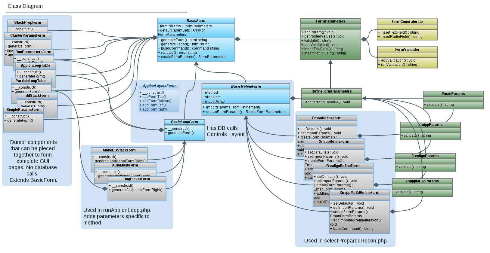

See feature #2634 and #2841 for more information on the code that supports these directions.

# **Add a wiki page to the [Appion User Guide](/appion/Appion_Manual/Appion_User_Guide/Appion_Processing) describing how to use this feature**
 

You can just add a shell and a description of what it does to start. You can add screen shots and parameter details after adding the GUI completely. You just need to have the URL available for subsequent steps in this guide. If you are at a total loss, just link to the main table of contents: [Appion Processing](/appion/Appion_Manual/Appion_User_Guide/Appion_Processing)
 

# **Add a publication reference for the package you are using**
 

## Edit source:/trunk/myamiweb/processing/inc/publicationList.inc to include an entry for any references you need to add to your launch page.

## Adding the publication info here will also automatically take care of various ways of formatting the reference and make sure it is properly added to the list of sources available at index.php which provides the user with references they can copy and paste into their publications. It is important to test this and make sure your new publication shows up correctly in the index page as this is a very useful feature of Appion.

## Also add the publication to this list if is not already there: [citations](/appion/Appion_citations/)
 

# **Create a new form class for your feature**
 

Create a new file in myami/myamiweb/processing/inc/forms. Call it coolFeatureForm.inc.

Decide which Basic Form class you will be using as a base class.

### If you are adding a GUI to launch a python script that is based on the appionLoop class that is found in appionLoop2.py, you will base your GUI class on the BasicLoopForm.

Create a class in this file that extends the BasicLoopForm class like this:

    require_once "basicLoopForm.inc";

    class CoolFeatureForm extends BasicLoopForm
    {
    ...

Examples are available in source:/trunk/myamiweb/processing/inc/forms/autoMaskForm.inc and source:trunk/myamiweb/processing/inc/forms/makeDDStackForm.inc
 
---OR---

### If you are not using the appionLoop python script, base your new GUI form on the basicLayoutForm class (source:trunk/myamiweb/processing/inc/forms/basicLayoutForm.inc)

Create a class in this file that extends the BasicLayoutForm class like this:

    require_once "basicLayoutForm.inc";

    class CoolFeatureForm extends BasicLayoutForm
    {
    ...

Example: source:trunk/myamiweb/processing/inc/forms/uploadExternalRefine.inc

Use the following class diagram as reference

 

# **Set parameters needed by the Basic Form classes in the constructor**
 

    class CoolFeatureForm extends BasicLayoutForm
    {

      // This is the constructor function. It is called as soon as this class is 
      // instantiated with a line like: $form = new CoolFeatureForm($expId, $extraHTML).
      // The first 2 parameters are needed for the BasicLayoutForm class that this class extends from.  
      // The rest of the parameters are specific to this form.

      function __construct( $expId, $extraHTML='', $stackid='', $modelid='', $uploadIterations='', $mass='', $apix='', $box='') 
      {
        // You must first call the parent class(BasicLayoutForm) constructor. 
        // Pass it the $expId and $extraHTML variables. Errors and test results are passed through $extraHTML.

        parent::__construct($expId, $extraHTML);

        //------ Set Parameters for the parent class, BasicLoopForm or BasicLayoutForm (general Appion params) -----//

        // Set the publications to be references on the web pages
        $pubList = array('appion'); // The publication reference key that you added to publicationList.inc
        $this->setPublications( $pubList );

        // Job Type should be unique to Appion. Used in the database to determine the type of job being run.
        $this->setJobType( 'maskmaker' ); 

        // The name of the folder that all runs of this job type will be stored in.
        $this->setOutputDirectory( 'mask' );  

        // A portion of the run name that will be common (by default) to all runs of this job type. A unique number is appended to individual run names.
        $this->setBaseRunName( 'maskrun' ); 

        // The title on the web page for this feature.
        $this->setTitle( 'Auto Masking Launcher' ); 

        // The Heading on the web page for this feature.
        $this->setHeading( 'Automated Masking with EM Hole Finder' ); 

        // The name of the python executable file that this GUI corresponds to. It should be based on the AppionLoop class and located in the myami/appion/bin folder.
        $this->setExeFile( 'automasker.py' );

        // A URL corresponding to a wiki page in the Appion User Guide with information on running this feature.  
        $this->setGuideURL( "http://emg.nysbc.org/redmine/projects/appion/wiki/Appion_Processing" );

        // True to activate "test single image" field of Appion Loop parameters.
        $this->setTestable( True ); 

        // The output directory will be created in the Appion run directory rather than Leginon.
        $this->setUseLegOutDir( False );

        // Flag to hide the description field of the run parameters. True enables the description field.
        $this->setShowDesc( False ); 

        // Flag to use the cluster parameter form rather than the run parameter form.
        // Reconstructions and remote jobs use the cluster parameters, generic single processor jobs use run parameters.
        // Set to True to use Cluster Parameters
        $this->setUseCluster( False );

 

# **Take an inventory of the parameters that are specific to your new feature and are passed into your python executable file**

Make a list of all the parameters that your GUI needs to expose to the user. For each parameter decide on:

### **id** I might also call it a parameter key or name. This should match the name of the parameter as it appears on the command line. So a flag in a command that looks like "---mycoolflag" should be named "mycoolflag" in this class. AVOID using names with hyphens like *max-iter*. Try using underscores instead if possible.

### **default value**

### **label** This is the text that is actually shown to the user in the GUI next to the GUI element associated with it (check box, selection, text, etc)

### **help text** A longer description of the parameter and tips for what a user should set it to.

### **validations** Decide what should be considered valid values for this parameter. Is it required? Does it have to be a number or greater than zero?
 

# **Add your parameters help text to myami/myamiweb/processing/js/help.js**
 

Open source:/trunk/myamiweb/processing/js/help.js

Add a new namespace for your form, you can copy the 'simple' section. Don't forget any commas.

add a help string for each of the parameter keys in your form
 

# **Add your parameters to your form class constructor**
 

Back in the constructor function of the class that you created to extend BasicLoopForm or BasicLayoutForm, add your parameters.

First set the help section using the namespace that you just added to help.js.

    // Get an instance of the form parameters associated with this class
    $params = $this->getFormParams();

    // The help section corresponds to the array key for these parameters found in help.js for popup help.
    $params->setHelpSection( "em_hole_finder" );

Add a line for each of the parameters in your form. The first parameter of the addParam() function is the id of the param, followed by the default value (passed into the constructor), followed by the label (what is shown to the user in the GUI).

    $params->addParam( "downsample", $downsample, "Downsample" );
    $params->addParam( "compsizethresh", $compsizethresh, "Component size thresholding" );

Add any validation requirements that are needed for your parameters. Use the addValidation() function of the FormParameter class. The first field is the parameter id. The second field is a key word that corresponds to the type of validation needed.

    $params->addValidation( "numpart", "req" );

Avaialble validation types are as follows, and updates can be found in formValidator.php (source:trunk/myamiweb/inc/formValidator.php)

    // available validations, check formValidator.php for changes:
    /*
         * required :                   addValidation("variableName", "req");
         * MaxLengh :                   addValidation("variableName", "maxlen=10");
         * MinLengh :                   addValidation("variableName", "mixlen=3");
         * Email    :                   addValidation("variableName", "email");
         * Numeric  :                   addValidation("variableName", "num");
         * Alphabetic :                 addValidation("variableName", "alpha");
         * Alphabetic and spaces :      addValidation("variableName", "alpha_s");
         * Alpha-numeric and spaces:    addValidation("variableName", "alnum_s");
         * Float:                       addValidation("variableName", "float");
         * absolute path: path_exist:   addValidation("variableName", "abs_path");
         * path existence :             addValidation("variableName", "path_exist");
         * folder permission :          addValidation("variableName", "folder_permission");
         * file existence :             addValidation("variableName", "file_exist");
         * Float w/fixed decimal space: addValidation("variableName", "float_d=2");
    */

 

# **Generate a form for the parameters that are specific to this program (not AppionLoop params)**
 

There are 2 places available for adding your own parameters to the GUI page. The most common place is to the Right Hand side of the Appion Loop parameters. To add your parameters to this section of the screen, override the function called **generateAdditionalFormRight()** in your form class extending BasicLoopForm. You may also add parameters to the space on the left directly below the Appion Loop parameters by overriding the function called **generateAdditionalFormLeft()**. If you are extending your class from BasicLayoutForm, anything added to generateAdditionalFormLeft() will show up directly below the Run or Cluster parameters at the top of your form. These functions return the HTML code required to display your parameter GUI elements to the user. You may add HTML here directly.
 

To add the HTML code for an input element for your parameter, use one of the functions available in the FormParameters (source:trunk/myamiweb/inc/formParameters.inc) class. The first field of these functions is always the parameter id.
Current functions available include:

### insertHiddenField( $name ) -> use this for parameters that don't have a gui element that should still show up in the command after setting the value in the form constructor. See example of "localhost" in the clusterParamsForm.inc file

### insertTextArea( $name, $rows=3, $cols=65, $note='', $helpkey='' )

### insertTextField( $name, $size=20, $note='', $helpkey='' )

### insertTextFieldInRow( $name, $size=20, $note='', $helpkey='' )

### insertStackedTextField( $name, $size=20, $note='', $helpkey='' )

### insertCheckboxField( $name, $note='', $helpkey='' )

### insertRadioField( $name, $value, $label, $note='', $helpkey='' )

### insertSelectField( $name, $options, $note='', $helpkey='' )

### insertStackedSelectField( $name, $options, $note='', $helpkey='' )

Options for the SelectField functions MUST be a dictionary, to allow a more descriptive string to be shown to the user for each option, if desired. If the option value and description should be the same, then that value should be both the key and the value. The key is what gets kept in the POST array.

    $options = array( "first" => "first description", "second" => "second description"...)

 

        public function generateAdditionalFormRight()
        {
                    // Calling updateFormParams() will check the php $_POST array for any values that were previously set for the parameters in this form. 
            $this->updateFormParams();
            $params = $this->getFormParams();

            $fieldSize = 3;

            $html .= "<b>Make DD stack params:</b> \n";

            $html.= $params->insertCheckboxField( "align" );
            $html.= $params->insertCheckboxField( "defergpu" );
            $html.= $params->insertCheckboxField( "no_keepstack" );
            $html.= $params->insertTextFieldInRow( "bin", $fieldSize );

                    // It is important to return the $html variable. This contains all the 
                    // html code needed to display your parameters.
            return $html; 
        }   

 

1.  **If you have implemented "test single image" on the python side, add code to display the test results in your class extending BasicLoopForm**
     
    -   You can use the getTestResults() function in autoMaskForm.inc (source:trunk/myamiweb/processing/inc/forms/autoMaskForm.inc) as an example.
                // getTestResults() should return the HTML code needed to display test results any way this method
                // prefers to have them displayed. The results will be placed below a printout of the test command and 
                // above the launch form. Note that an instance of this class is not required to use this function.
                static public function getTestResults( $outdir, $runname, $testfilename )
                {
            ...

        
         
2.  **Add a link to your page in the menuprocessing.php file or from another page**
     
    -   The menuprocessing file is a bit tricky to work with.If you do not link to your page from there, look for the appropriate php page where your feature should launch from.
    -   You will add a link to runAppionLoop.php and pass the experiment ID and the name of your new form class in the URL. Here are a couple of examples with the MakeDDStackForm class and the AutoMaskForm Class:
            $ddStackform = "MakeDDStackForm";
            'name'=>"<a href='runAppionLoop.php?expId=$sessionId&form=$ddStackform'>Create frame stack</a>",

            $form = "AutoMaskForm";
            echo "  <h3><a href='runAppionLoop.php?expId=$expId&form=$form'>Auto Masking</a></h3>\n";
    -   Note that the name of the class MUST match the name of the PHP file that the class is defined in. So if you extended the BasicLoopForm to a class named CoolFeatureForm, the file where that class lives must be at myami/myamiweb/processing/inc/forms/coolFeatureForm.inc.
         
3.  **Add installation instructions for any new 3rd party software required**
     
    -   If this feature requires 3rd party software on the python side on the processing host, add directions for installing this software now. It should have a new wiki page under the [Processing Server Installation](/appion/Appion_Manual/Complete_Installation/Processing_Server_Installation) instructions.
         
