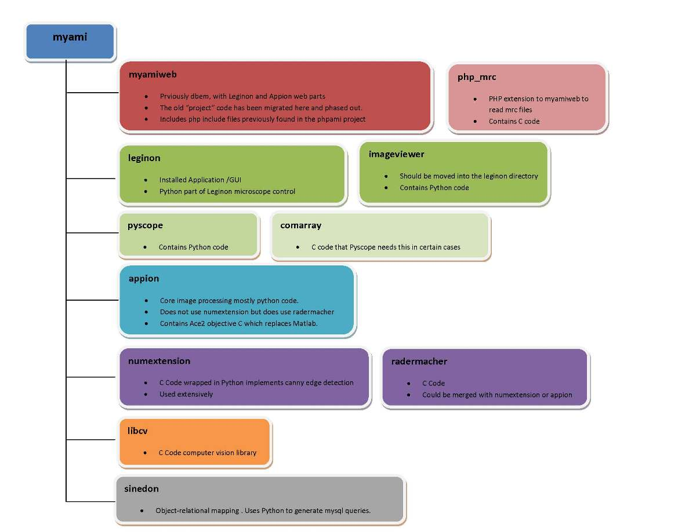

-   Sinedon
    -   Generates queries.
    -   Uses Python to generate mysql
-   Appion
    -   Core image processing code.
    -   Does not use numextension but does use radermacher
    -   Contains Ace2 objective C which replaces Matlab
    -   Mostly Python code.
-   Leginon
    -   Microscope control
    -   Installed Application
    -   Includes a GUI
    -   This is the Python part of Leginon
-   Imageviewer
    -   Should be moved into the leginon directory
    -   Contains Python code
-   Pyscope
    -   Contains Python code
-   Comarray
    -   C code
    -   Pyscope needs this in certain cases
-   Myamiweb
    -   Used to be called dbem
    -   Contains Leginon and Appion web parts
    -   Includes the PHP part of Leginon
    -   The old "project" code has been migrated here and phased out.
-   Phpami
    -   Contains PHP code
    -   Denis made these 3 include files separate so they would not be public.
    -   These files will eventually be moved to myamiweb and this folder will phase out.
-   Php_mrc
    -   PHP extension to myamiweb to read mrc files
    -   Contains C code
-   Numextension
    -   C Code wrapped in Python
    -   Implements canny edge detection
    -   Used extensively
-   Radermacher
    -   C Code
    -   Could be merged with numextension or appion
-   Libcv
    -   C Code
    -   Computer vision library
-   Pyami
    -   Common Python libraries used by appion and leginon
    -   Image processing
    -   Randoms
