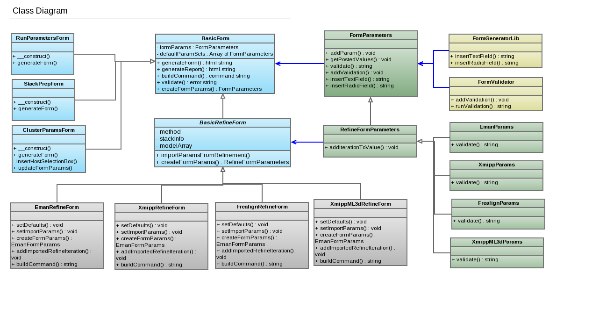
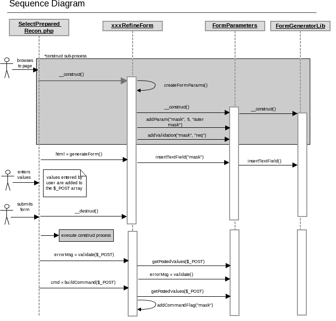

## Steps to add a new refinement method to the pipeline

# Add an entry to selectRefinementType.php for the new method.

## Add a logo image to the myamiweb/processing/img file if it does not already exist.

## In myamiweb/processing, open selectRefinementType.php and copy and existing methods code block.

## Replace the logo image file with the appropriate file name

## Replace the method key with an appropriate short name that indicates the type of method you are adding. This key will be used in other files to identify the type of refinement to launch. For example, in the following line of code **method=eman** should be replaced with an appropriate method name.

    <h3><a href='selectStackForm.php?expId=$expId&method=eman'>EMAN1 projection-matching refinement</a></h3>

## Edit the description of the method to be informative to a novice user.
 

1.  Add a reference paper related to the method.
    1.  Open myamiweb/processing/inc/publicationList.inc and copy a $PUBLICATIONS array entry code block.
    2.  Modify the fields for the publication that should be referenced for the method you are adding.
    3.  Modify the $PUBLICATIONS array key to match the method key that you defined in selectRefinementType.php.
         
2.  Create a python class to run the preprefine step.
    1.  You must name the file prepRefineMethod.py where *Method* is the same method key that you used in the previous step, except the first leter of the method is capitalized. This file should be located in myami/appion/bin and can be created by copying a similar existing methods prepRefine file.
    2.  Modify the setRefineMethod() function. The *self.refinemethod* parameter should be set to 'methodrecon' where *method* is the same as the method key defined in selectRefinementType.php.
               def setRefineMethod(self):
                  self.refinemethod = 'xmipprecon'

        
         
3.  Create a new class which extends BasicRefineForm
    1.  You can copy an existing methods form, such as xmippRefineForm.inc in myamiweb/processing/inc/forms.
    2.  Name the file methodRefineForm.inc where *method* is the same as the method key used in the above steps.
    3.  There are several functions in this class to define AFTER you have created the RefineFormParameters class as described below.
         
4.  Create a new class which extends RefineFormParameters. This is optional, but recommended.
    1.  Decide what information you need to collect from the user and add a form parameter for each item.
        1.  note that the parent constuctor is called first, passing any default values along. The RefineFormParameters base class defines parameters that are common to most refinement methods. You only need to add parameters that are not already defined in the base class.
        2.  use the addParam(name, value, label) method to add parameters specific to your refine method to your form.
        3.  if you find that the base class includes a parameter that your method does not need, you can remove the parameter from the form with the hideParam(name) method.
                class XmippParams extends RefineFormParameters
                {
                    function __construct( $id='', $label='', $outerMaskRadius='', $innerMaskRadius='', $outerAlignRadius='', 
                                            $innerAlignRadius='', $symmetry='', $numIters='', $angSampRate='', $percentDiscard='',  
                                            $filterEstimated='', $filterResolution='', $filterComputed='', $filterConstant='',
                                            $mask='', $maxAngularChange='', $maxChangeOffset='', $search5DShift='', $search5DStep='',
                                            $reconMethod='', $ARTLambda='', $doComputeResolution='', $fourierMaxFrequencyOfInterest='' ) 
                    {
                        parent::__construct($id, $label, $outerMaskRadius, $innerMaskRadius, $outerAlignRadius, 
                                            $innerAlignRadius, $symmetry, $numIters, $angSampRate, $percentDiscard,  
                                            $filterEstimated, $filterResolution, $filterComputed, $filterConstant );

                        $this->addParam( "mask", $mask, "Mask filename" );
                        $this->addParam( "maxAngularChange", $maxAngularChange, "Max. Angular change " );       
                        $this->addParam( "maxChangeOffset", $maxChangeOffset, "Maximum change offset " );
                        $this->addParam( "search5DShift", $search5DShift, "Search range for 5D translational search " );
                        $this->addParam( "search5DStep", $search5DStep, "Step size for 5D translational search " );
                        $this->addParam( "reconMethod", $reconMethod, "Reconstruction method " );
                        $this->addParam( "ARTLambda", $ARTLambda, "Values of lambda for ART " );
                        $this->addParam( "doComputeResolution", $doComputeResolution, "Compute resolution? " );
                        $this->addParam( "fourierMaxFrequencyOfInterest", $fourierMaxFrequencyOfInterest, "Initial maximum frequency used by reconstruct fourier " );

                        // disable any general params that do not apply to this method
                        $this->hideParam("innerMaskRadius");        
                    }

                    function validate() 
                    {
                        $msg = parent::validate();

                        if ( !empty($this->params["mask"]["value"]) && !empty($this->params["outerMaskRadius"]["value"]) )
                            $msg .= "<b>Error:</b> You may not define both the outer mask raduis and a mask file.";

                        return $msg;
                    }
                }
        4.  define any restrictions that should be applied to the parameters.
    2.  Override the advancedParamForm() function in your RefineForm class to add a user input field for each one of the methods parameters.
    3.  Override the buildCommand() function in your RefineForm class only if necessary. There is a default implementation available which adds all form parameters as ---`<name>=`<value>.
         
5.  Add your new form type to selectPreparedRecon.php
    1.  Add a require_once statement to the top of the file to include your new inc/forms/methodRefineForm.inc
    2.  Edit the createSelectedRefineForm() function to include your new method in the switch statement and create a new instance of your form.
    3.  The method key should correspond to the one used in prepRefineMethod.py setRefineMethod() function.
            // based on the type of refinement the user has selected,
            // create the proper form type here. If a new type is added to
            // Appion, it's form class should be included in this file
            // and it should be added to this function. No other modifications
            // to this file should be necessary.
            function createSelectedRefineForm( $method, $stacks='', $models='' )
            {
                switch ( $method ) {
                    case emanrecon:
                        $selectedRefineForm = new EmanRefineForm( $method, $stacks, $models );
                        break;
                    case frealignrecon:
                        $selectedRefineForm = new FrealignRefineForm( $method, $stacks, $models );
                        break;
                    case xmipprecon:
                        $selectedRefineForm = new XmippRefineForm( $method, $stacks, $models );
                        break;
                    case xmippml3drecon:
                        $selectedRefineForm = new XmippML3DRefineForm( $method, $stacks, $models );
                        break;
                    default:
                        Throw new Exception("Error: Not Implemented - There is no RefineForm class avaialable for method: $method"); 
                }       

                return $selectedRefineForm;
            }

        
         
6.  Edit refineJobsSingleModel.inc or RefineJobsMultiModel.inc setDBValues() function to include the method keys and job types used for the new method.
     
7.  Edit myamiweb/processing/js/help.js to add pop-up help messages to your new form parameters.
    1.  copy and paste a code black at the end of the file.
    2.  Ensure that you have added a comma to the end of the second to last entry in this help array and the final entry is not followed by a comma.
    3.  make sure the key value that you add to the help array, matches the value set in your new methodRefineForm.inc file advancedParamForm() functions:
            $params->setHelpSection( "relion" );

## Class Diagram

The following class diagram shows the BasicForm class with it's extended classes as well as the FormParameter class and it's extended classes.
It also shows associations among the classes.
Notice that the specific refine parameter classes use polymorphism to override the validate() function. This allows the extended classes to provide more complex validations than a typical form requires.
Other forms, such as RunParameters and stack prep, just use the base FormParameters class that their parent, BasicForm, uses.

## Sequence Diagram

The following sequence diagram shows how the Form and Parameter classes work together to display a form, validate the user input, and create a command string.

