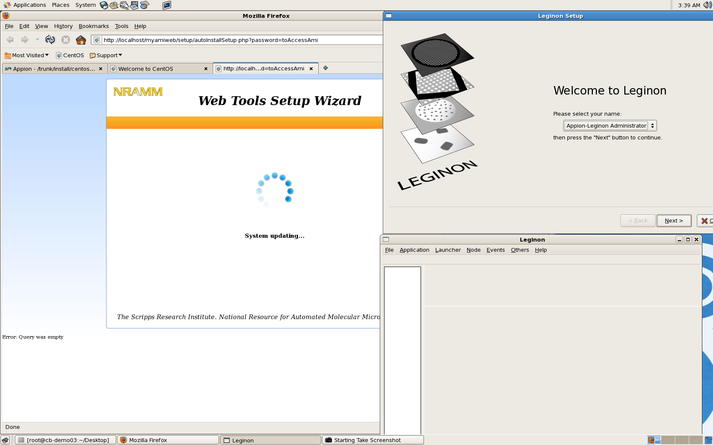
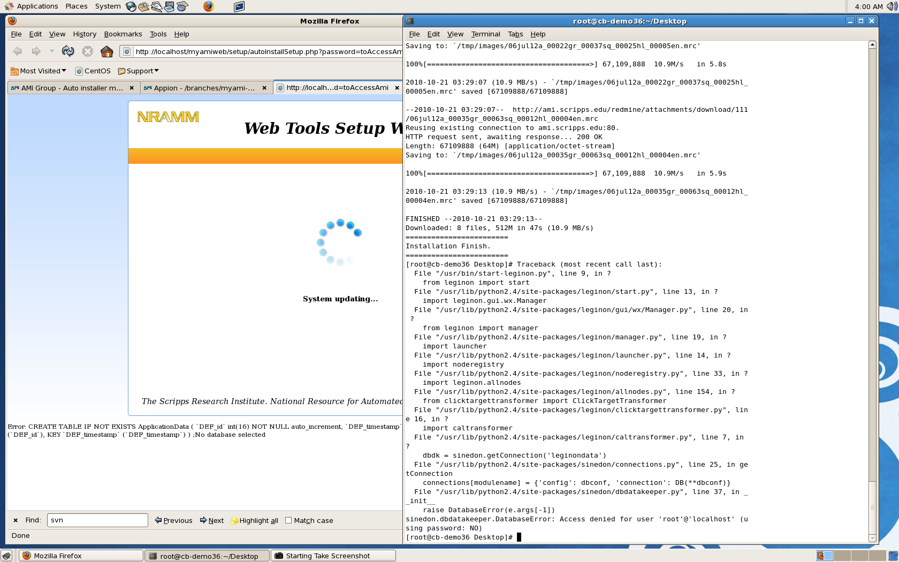
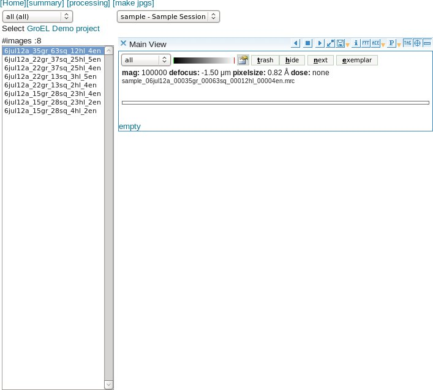

This quick installation script installs both Appion and Leginon on a single computer running the CentOS 6 or 7 Linux operating system. This is not really intended for production systems but is instead perhaps a useful way to evaluate the software prior to undertaking a more complex installation across multiple CPU's. Please note that the auto-installation is intended for use with a clean installation of CentOS 6 or 7 and might fail if you already have several other packages installed.

Follow the instructions below to install Appion and Leginon using the auto-installation script.

1.  [Install CentOS](/appion/Appion_Manual/Complete_Installation/Instructions_for_installing_CentOS_on_your_computer/).
    **Disable SELinux during the installation.** You can check to see if it is enabled after the centOS installation with:
        /usr/sbin/selinuxenabled
        echo $?

    
    If SELinux is enabled, the return value is 0. If it is disabled, the return value is 1. If you need to disable SELinux, follow the instructions for disabling SELinux found in the troubleshooting section of this document.
    The Auto-Installer currently assumes that you have a fresh centOS installation and that you have not set up a mysql database.
     
2.  Login to CentOS as the root user. Note that there seems to be an [issue](http://stackoverflow.com/questions/1421498/linux-gedit-i-always-get-gconf-error-failed-to-contact-configuration-server) with using su to become root user which prevents the autoinstaller from running to completion.
     
3.  [Request a registration key](/appion/AppionRegkey_request) which will be needed during installation. We ask that you register so that we can inform the owners of processing packages such as EMAN, XMIPP and SPIDER how many people are recieving their software from us. These numbers help them gain funding to maintain the software.
     
4.  Download centosAutoInstallation.py for CentOS 6 or centos7AutoInstallation.py for CentOS 7.

1.  Open a Terminal, go to the download directory and run:
    On CentOS 6:
        python centosAutoInstallation.py

    On CentOS 7:
        python centos7AutoInstallation.py
2.  Enter an administrator's email address, and root password when prompted.
     
3.  You may choose to install several of the third party software packages that Appion uses for image processing. If you do not allow the installer to install them at this time, you can follow the manual installation instructions found toward the end of this page. **Most old packages do not install on CentOS7. This option is disabled in centos7autoinstallation.py**
     
4.  Wait. Depending on how many packages are updated during *yum update*, installation could take anywhere between 6 minutes and 2 hours.
     
5.  When the installation completes:
    1.  A log file will be created called installation.log. You may want to view it and look for any errors.
    2.  The Leginon start page will be displayed. This indicates that Leginon python components are installed correctly.
    3.  A web browser will be launched with the Appion and Leginon tools loaded. A few initialization happens in there and then the home page appears if everything works out.
         
6.  There are some additional changes that need to be made at this point.

## Where did things go ?

1.  myami git clone: /tmp/myami
2.  myami python package installation: /usr/lib/python2.7/site-packages
3.  myami appion scripts: /usr/bin/appion
4.  myamiweb copy for web service: /var/www/html/myamiweb
5.  myami configurations: /etc/myami
6.  mysql root password is default to the host root password you gave at the beginning of the script.
7.  for myamiweb, administrator has a default password of the host root password you gave at the beginning of the script.

1. Click on **[test dataset]**
 
2. You should see two images in an image viewer. If they are not visible, run the troubleshooter by clicking on **[]{lang="Troubleshoot"}**.
 
3. Click on **[]{lang="Home"}** to return to the start page.
 
4. Click on Project DB and you should find a GroEL Demo project that has been created for you.
 
5. Return to the **[]{lang="Home"}** page.
 
6. Click on **[Image Viewer]** and you should find the sample images that have been added to a Sample Session in the Demo Project. If you do not see images, and just the word "empty", you may need to start the Redux image server.
 
7. Click on **[]{lang="Processing"}** to begin running image processing jobs on the sample GroEL images.
 
8. Following the directions in [Process Images](/appion/Appion_Manual/Complete_Installation/Create_a_Test_Project/Process_Images) is a good test of the installation.
 
9. You will want to continue by installing the third party processing packages which are required for many of the features supported by Appion:

Appion scripts interact with external packages in one of the two ways: Executing a shell command, or through python call. The name of the file in the call may not be the same as the standard installation as described by the package distributor.

If it is accessed from shell, you should either create soft link (preferred) or rename the file you downloaded (not best practice since you may get confused later. Test its accessibility from the environment you would run appion script.

For example, ctffin4 of whatever version would typically installed in /usr/local/bin. The executable file in there is called ctffind4.exe. You should do

cd /usr/local/bin
ln -s ctffind64.exe ctffind4

Next time, when you start a shell, try:

which ctffind4

It should be able to find the link and the actual executable file.ctffind64.exe

For files called through python, the file need to be in the environment variable PYTHONPATH You can test it in the appion environment with an import test.

python
python> import deProcessFrames

## Program/module call alias name in Appion (myami-3.3, myami-beta branches, and trunk)

## Package alias table

Those not mentioned here uses the original names in the call.

------------------------------------------------------------------------

program package name version appion executable alias Accessible
MotionCor2 1.0.2 motioncor2 shell
motioncorr v2.0 from Purdue 2.0 dosefgpu_driftcorr shell
DE_process_frames.py 2.7.1 deProcessFrames.py pythonpath
ctffind4 4.1.5 ctffind4 shell
Gctf 1.06 gctfCurrent shell
ctftilt 1.5 ctftilt.exe shell
FindEM 20/10/01 findem64.exe shell
Gautomatch 0.53 gautomatch shell
Spider 18.10 spider shell
frealign 9.11 frealign_v9.exe and frealign_v9_mp.exe shell
xmipp2 cl2d* 2.4 xmipp_mpi_class_averages shell
xmipp3 cl2d* 3.1 xmipp_classify_CL2D shell
EMAN1 proc2d 1.9 proc2d shell
------------------------------------------------------------------------------------------------------------------------------------------------ ------------------------------------------------- ---------------------------------------------------------------------------------------------------------------------------------------------------------------------------------------------------------- ------------------------------------------------------------

- default environment is xmipp2. All other xmipp functions wraps around xmipp2.
- xmipp3 conflict with xmipp2 is resolved in appion/bin/runXmipp3CL2D.py with a line of code
csh -c 'modulecmd python load xmipp/3.1'

Change it if desired.

## Installation

[External Package requirement of Appion scripts](/appion/Processing_Server_External_Packages_Installation/External_Package_requirement_of_Appion_scripts)

### Required for preprocessing pipeline up to stack making for Relion/CryoSparc

1. [Configure .appion.cfg](/appion/Appion_Manual/Complete_Installation/Processing_Server_Installation/Configure_appioncfg)
2. [Install External Packages](/appion/Appion_Manual/Complete_Installation/Processing_Server_Installation/Install_External_Packages)
3. [MotionCor2](/appion/Appion_Manual/Complete_Installation/Processing_Server_Installation/Install_dosefgpu_driftcorr/Install_motioncor2_shared)
4. [Install Gctf](/appion/Install_Gctf)
5. Install CtfFind. See [Install Grigorieff lab software](/appion/Install_Grigorieff_lab_software)

### Recommended for preprocessing pipelin particle picking

1. [Compile FindEM](/appion/Appion_Manual/Complete_Installation/Processing_Server_Installation/Compile_FindEM)

### Required for 2D classification and other functions

1. [Install EMAN](/appion/Appion_Manual/Complete_Installation/Processing_Server_Installation/Install_EMAN) (Only works for CentOS 6)
2. [Install EMAN2](/appion/Install_EMAN2)
3. [Install SPIDER](/appion/Appion_Manual/Complete_Installation/Processing_Server_Installation/Install_SPIDER)
4. [Install Xmipp](/appion/Appion_Manual/Complete_Installation/Processing_Server_Installation/Install_Xmipp) (Xmipp2 Only works for CentOS 6)
5. [Install UCSF Chimera](/appion/Appion_Manual/Complete_Installation/Processing_Server_Installation/Install_UCSF_Chimera)
6. [Install Ace2](/appion/Appion_Manual/Complete_Installation/Processing_Server_Installation/Install_Ace2)
7. [Install Imod](/appion/Appion_Manual/Complete_Installation/Processing_Server_Installation/Install_Imod)
8. [Install Protomo2](/appion/Appion_Manual/Complete_Installation/Processing_Server_Installation/Install_Protomo2)
9. [Install EM Hole Finder](/appion/Appion_Manual/Complete_Installation/Processing_Server_Installation/Install_EM_Hole_Finder)

### Older packages, install only if you still want to use them

1. [MotionCorr](/appion/Appion_Manual/Complete_Installation/Processing_Server_Installation/Install_dosefgpu_driftcorr) (optional)
2. [Install SIMPLE](/appion/Appion_Manual/Complete_Installation/Processing_Server_Installation/Install_SIMPLE)

### Testing

1. [Test Appion](/appion/Appion_Manual/Complete_Installation/Processing_Server_Installation/Test_Appion)

# Troubleshooting

## Having trouble with autoinstaller in general when CentOS is not fresh.

The autoinstaller assumes a fresh CentOS installation. If some of the previously installed packages had dependency that conflict with what Appion/Leginon uses, problems may occur.

In this case, we suggest run the steps individually to see if you can identify the real problem. We have a user reported that just by performing them step-by-step.

## SELinux is Enabled

If your installation completes and you see a Welcome to Leginon window, a second Leginon window that appears blank and a web page with the Web Tools Setup wizard in a System updating state as shown below, you have installed CentOs with Security Enhanced Linux enabled. You need to disable SE Linux:

1.  Edit file "/etc/selinux/config"
2.  Change "SELINUX=enforcing" to "SELINUX=disabled"
3.  Save the file
4.  Restart your computer

Once SELinux is disabled, the configuration will complete on its own.

You may need to [Appion:reconfigure the database](/appion/Appionreconfigure_the_database) if the Tools web page is not displayed.

 

## A database was previously configured

If you see the errors shown in the screen below, you may have previously configured a database with mysql. You will need to re-install CentOS and run the installation script again.

## The Redux image server is not running

If you don't see micrograph images in the online image viewer, and instead see the word "empty" as shown in the screen below, you may need to start the Redux image server. The command is:

CentOS 7

    systemctl start reduxd

CentOS 6

    /sbin/service reduxd start

