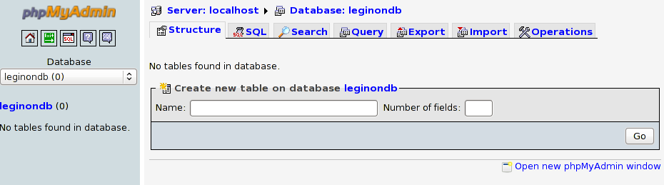

You are not required to install phpMyAdmin for Appion or Leginon, however, it is a useful tool for interfacing with the mysql databases.

## Install supporting packages

  Name:       Download site:                 yum package name   SuSE rpm name
  ----------- ------------------------------ ------------------ ---------------
  PHP         http://php.net/downloads.php   php                
  php-mysql                                  php-mysql          

## Install phpMyAdmin

If you have not already installed phpMyAdmin, do so. The yum installation is:

    sudo yum -y install phpMyAdmin

## Configure phpMyAdmin

Edit the phpMyAdmin config file `/etc/phpMyAdmin/config.inc.php` and change the following lines:

    sudo nano /etc/phpMyAdmin/config.inc.php

    $cfg['Servers'][$i]['AllowRoot']     = FALSE;
    $cfg['Servers'][$i]['host']          = 'mysqlserver.INSTITUTE.EDU';

Edit the phpMyAdmin apache config file `/etc/httpd/conf.d/phpMyAdmin.conf` and change the following lines:

    sudo nano /etc/httpd/conf.d/phpMyAdmin.conf

    <Directory /usr/share/phpMyAdmin/>
       order deny,allow
       deny from all
       allow from 127.0.0.1
       allow from YOUR_IP_ADDRESS
    </Directory>

**Note:** If you want to access phpMyAdmin from another computer, you can also add it to this config file with an `allow from` tag

## Restart Web Server

Next restart the web server to take on the new setting

    sudo /sbin/service httpd restart

## Test the configuration

To test the phpMyAdmin configuration, point your browser to http://YOUR_IP_ADDRESS/phpMyAdmin or http://localhost/phpMyAdmin and login with the usr_object user.

A common problem is that the firewall may be blocking access to the web server and mysql server. On CentOS/Fedora you can configure this with the system config:

    system-config-securitylevel

Firewall configuration is specific to different Unix distributions, so consult a guide on how to do this on non-RedHat machines.
