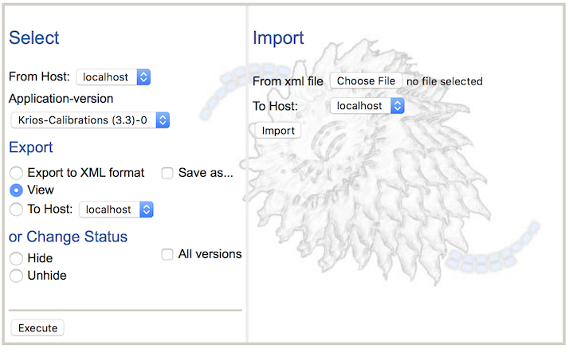

Applications define how nodes are linked together in order to form a specialized Leginon application or program. Because Leginon uses a nodal or modular archetecture, multiple applications can be created by linking together nodes in different fashions suitable for the current experiment. Several default Leginon applications are distributed with the release. This section enables the Leginon user to import and export applications.

## Import Applications online

-   Open a web browser. Go to http://yourhost/myamiweb/admin.php

-   Click on Applications.

-   Enter the name of the Leginon application XML file. These are files in a subdirectory of your leginon installation or download (myami/leginon) called "applications"

-   Select the name of the "To" Host the application will be imported to.

-   Click Import.

## Export Applications online

## to another Host

-   Open a web browser. Go to http://yourhost/myamiweb/admin.php

-   Click on Applications.

-   Select the name of the "From" Host.

-   Select the name of the Leginon application.

-   Select the "To" Host.

-   Click "Execute"

## to a Leginon application XML file

-   Open a web browser. Go to http://yourhost/myamiweb/admin.php

-   Click on Applications.

-   Select the name of the "From" Host.

-   Select the name of the Leginon application.

-   Keep "Export to XML format" enabled.

-   Enable "Save as"

-   Click Execute

## to the screen in XML format

-   Open a web browser. Go to http://yourhost/myamiweb/admin.php

-   Click on Applications.

-   Select the name of the "From" Host.

-   Select the name of the Leginon application.

-   Keep "Export to XML format" enabled.

-   Click Execute

## to the screen in "easy-to-read" format

-   Open a web browser. Go to http://yourhost/myamiweb/admin.php

-   Click on Applications.

-   Select the name of the "From" Host.

-   Select the name of the Leginon application.

-   Select View

-   Click Execute

## Hide Applications

Over time, there will be too many application accumulated that you may not use any more. You can use the same interface to hide them.
Since each edit of the application in Leginon Application Editor or import is given a new version and will display the newest non-hidden version in leginon, hiding only the most recent version is equivalent of undo changes.

you may find it necessary to hide all versions if you want to hide the entire application.

-   Open a web browser. Go to http://yourhost/myamiweb/admin.php

-   Click on Applications.

-   Select the name of the "From" Host.

-   Select the name of the Leginon application.

-   Select Hide

-   Activate the checkbox for all versions if desired.

-   Click Execute

It should contain tables of Application Data, NodeSpec Data, and likely BindingSpec Data.

[< Revert Settings](/leginon/Leginon_Manual/Administration_Tools/Default_Settings) | [Goniometer >](/leginon/Leginon_Manual/Administration_Tools/Goniometer)
