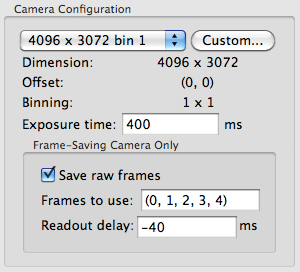

## Camera Settings for DE-12

-   **Exposure time**: total sensor readout time(?). **DE-12 software rounds up the time to next valid readout time that is multiple of time length of a single frame**.
-   **Save raw frames** check box: Determines whether all raw frame images within the exposure time are saved or discarded.
-   **Frames to use**: Frame numbers listed in a tuple to be summed up and saved by Leginon which will be displayed in web image viewer. **Empty Entry means use all frames**
-   **Readout delay**: The difference in time between beam-blank shutter opening and start of sensor signal readout.

Camera Settings for frame-saving camera like DE-12 have options that are meaningless for traditional CCD. In the example camera settings shown above, we set the camera to read out at 25 frames per second, i.e., 40 ms per frame determined by MicroManager program provided by Direct Electron before starting Leginon. At this fixed rate, the 400 ms exposure time corresponds to 10 frames. In this example, the summed image returned to Leginon only contains frames 0 to 4, while all 10 frames are saved as raw frames on DE12 computer. In addition, we set --40 ms readout delay so that the readout starts 40 ms before beam-blank shutter is opened.

# Properties of DE-12 Camera and their impact on Leginon functions

## Computer controlling the camera is not the one controlling the microscope

### Impact on Leginon:

All applications that use DE-12 should be ones with postfix of 2 (i.e. Calibrations2, MSI-T2). See [Using Leginon on a system where the microscope and camera are controlled by different computers](/leginon/Using_Leginon_on_a_system_where_the_microscope_and_camera_are_controlled_by_different_computers)

## Radiation Damage Sensitivity

DDD is more sensitive to radiation damage, which can be monitored by checking dark noise. We plan to measure and save this type of monitoring in Leginon database. For now, there is a simple script "measure_leakage.py" which is provided in the pyscope package. Run this script from time to time to test its value at the same set temperature. It will acquires some dark images and output a calculated dark noise and leakage.

### Impact on Leginon functions:

-   DO NOT attempt beam shift calibration on DE-12. Nor should you use  The concentrated beam causes too much radiation damage.
-   Warm up the camera to room temperature if it will not be used for a few hours. It can reverse some of the temporary effect of the damage.

## Exposure Time considerations

  -------------------------------- -------------------------------- --------------------------------------------
  property                         traditional CCD                  DE-12
  allowed exposure time interval   1 ms or less                     multiple of length of time for one frame
  minimal exposure time            beam shutter limited (~ 5 ms)   frame rate limited (~25 ms @ 40 frames/s)
  -------------------------------- -------------------------------- --------------------------------------------

### Impact on Leginon functions:

-   Exposure time entered in Leginon does not always equal to the actual exposure time the camera use. DE-12 software may alter it to next multiple of frame rate.
    **For presets, check the actual exposure time by getting the values back "From Scope" with 

-   Match dose function in "Acquire Dose Image" tool in Presets Manager does not work right because it can not fine tune the exposure time.
    -   You will need to adjust the beam size, not the exposure time to achieve the desired dose that falls between two frame length.

-   Tomography application does not work with DE-12, yet because it needs to fine-tune dose at each tilt.

-   If frame rate is altered in MicroManager, New dark/bright references need to be acquired.
    -   Leginon can scale the dark reference by number of frames, but not by different frame rate.

## Rolling shutter

DE-12 uses a rolling shutter that minimizes dead time between frames. However,as a result, the first row is read almost one frame before the last row inside a given frame of readout. If the beam shutter is opened at the same time as the start of the sensor readout, a gradient of intensity would be seen in the first frame since the first row received no beam before readout while the last row received the full dose in the time length of the frame. **Users should adjust the readout delay according to their need**.

### Impact on Leginon usage:

-   It is best to apply minimum of two frame length positive sensor readout delay for bright image acquisition to achieve uniform intensity even in the first recorded frame since it will be scale down (i.e.,divided by number of frames) to single frames in the raw frame movie stack making.
-   To catch onset of the beam, apply a negative sensor readout delay.
-   If need to use DE-12 for low-mag MSI imaging, use a slight positive readout delay to couple with minimal exposure time and camera binning. Compare the intensity of the image at different readout delay to choose the appropriate value. Without positive readout delay, the minimal exposure image would have low signal-to-noise ratio and strong gradient. Too much delay may damage the specimen more than acceptable.
