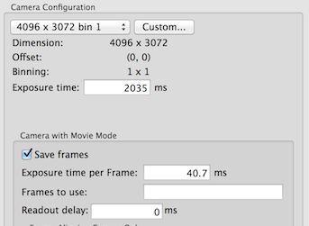

This known to work on DE-12 and DE-20

## Camera Configuration for raw frame saving

1.  Select "save raw frames"
2.  "Exposure time" specifies the total time in which the frames are saved.
3.  "Frame time" defines the length of each frame. The minimal value than can be set is limited by the sensor clock frequency.
4.  "Frames to use" needs an input of a tuple, such as (0,1,2,3,4,5), gives the frame numbers used in the summed images returned to Leginon for display or to be processed as a classical image. It does not affect number of raw frame saving. If left blank, all frames will be used for the sum.
    **If you increase the exposure time and also want to increase the frames in the returned sum image, make sure you either erase "Frames to use" to use all frames for sum, or adjust the tuple in "Frames to use" accordingly**
5.  "Readout Delay" sets the delay of frame saving relative to the shutter opening. Positive value means the frames starts to be recorded after the shutter is opened. Negative value means that the frame saving starts before the shutter is opened. Delay of 0 will include the ramp-up frame 0.

## File location:

You must create the parent directory described below manually.

    DECamera computer D:\RawFrames\DE12

Each set of raw frame is saved in TIFF format in a folder identified by the date and a unique number. This is set by the camera software.
Leginon retrieve this and saved in its database so that [rawtransfer.py](/leginon/Leginon_Manual/Complete_Installation/Installation_on_the_instrument_computers/Installation_on_the_camera_computer/Direct_Electron_DE-12_direct_detection_device_support/DDD_raw_frame_file_transfer) script can transfer it to the Leginon rawdata directory under the same session.

The file location is determined by the camera software, not Leginon.
