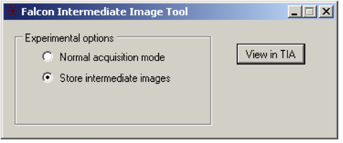
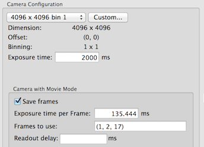
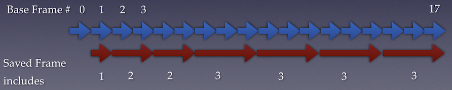

Falcon II base frame (the frame defined by the camera rolling shutter) rate is ~ 18 frames per second.

Raw frame saving can be achieved either with an custom hardware modification as designed at MRC-LMB or directly through FEI "Inermediate Image" tool. We only have experience in the latter.

## Saving raw frame in Leginon

1. Activate "Store intermediate images" option in C:\Titan\Exe\IntermediateImageTool.exe (or FalconInterImageTool.exe)

2. Edit the camera configuration of the imaging condition preset that you'd like to save frames like this:

-   Frame saving should only be used on the 4096x4096 bin 1 camera configuration.
-   **Exposure time** is the total integration time of the camera image returned to Leginon. This should be approximately equal or higher than the mid-point exposure time of the last base frame saved.
-   **Frames to Use**, defines the way base frames are saved in the saved frame bins as explained in the next section. This is the only input that that affects the frame saving. "Exposure Time per Frame" and "Readout Delay" are ignored in the algorithm for this camera.

Activate the checkbox "Save Frames" to use the configuration when the preset is used.

### Configure frame saving using "Use Frames" settings

Falcon Intermediate Image Tool allows base frames to be saved in 7 frame bins.

Frame number 0 that started readout as the beam shutter is open is usually discarded.

The format of this input is: (first_frame_number, first_distributed_frame_number, last_frame_number)

Frame number starts from 0 but frame 0 is normally discarded.
|parameter|description|example value|
|first_frame_number|The base frame number where the frame saving starts|1|
|first_distributed_frame_number|Base frames before this will each occupies one saved frame bin. Starting from this frame number, Leginon will attempt to put the same number of base frames in each remaining saved frame bin.|2|
|last_frame_number|The last base frame number to be saved.|17|

This figure shows how the 17 frames are put into 7 saved frame bins according to a settings of (1,2,17)
The first bin includes frame 1 only. The algorithm takes the remaining 16 base frames and divide them into (7-1)=6 bins. As a result, each bin contains at least 2 base frames. The remaining (17 - 1 - 2*6) = 4 base frames are put in the last four bins since these are less likely to have motion that requires correction.

Falcon Intermediate Image Tool allows base frames to be saved in 7 frame bins.

For raw frame saving using FEI's software, the midpoint time of the starting and ending base frames to be included in saved frame bin is defined by an xml file on Titan as

C:\Titan\Data\Falcon\IntermediateConfig.xml

To adjust the way the frames are saved in the bins, this file needs to be re-configured.

Leginon handles this configuration file modification required for each image acquisition. However, if you need to generate your own, such as when setting it up for obtaining gain/dark reference in TUI's Reference Manager, you can make a copy of the python script in myami/pyscope/falconframe.py and run it alone.

python falconframe.py exposure_time_in_second first_distributed_frame_number

For example:

python falconframe.py 1.0 2

generates this xml file equivalent to Leginon camera config *Frames to Use" (1,2,17)

`<IntermediateConfig>
`<FormatVersion>1.0`</FormatVersion>
`<StoragePath>E:\frames/20140808_14395200`</StoragePath>
`<InterFrameBoundary>0.084 - 0.084`</InterFrameBoundary>
`<InterFrameBoundary>0.139 - 0.195`</InterFrameBoundary>
`<InterFrameBoundary>0.251 - 0.363`</InterFrameBoundary>
`<InterFrameBoundary>0.418 - 0.530`</InterFrameBoundary>
`<InterFrameBoundary>0.586 - 0.697`</InterFrameBoundary>
`<InterFrameBoundary>0.753 - 0.864`</InterFrameBoundary>
`<InterFrameBoundary>0.920 - 1.032`</InterFrameBoundary>
`</IntermediateConfig>

## File location:

The raw frame files are saved in

    E:\frames

The file location is determined in pyscope/falconframe.py in the statement

    self.base_frame_path = 'E:\frames'

You must create this parent directory manually before starting saving the frames. Saving the raw frame file directly on to a network drive has not worked for us.

Each set of raw frame is saved in a folder identified by the date and a unique number. This is set by Leginon in pyscope/falconframe.py.
Leginon retrieve this and saved in its database so that [rawtransfer.py](/leginon/Leginon_Manual/Complete_Installation/Installation_on_the_instrument_computers/Installation_on_the_camera_computer/Direct_Electron_DE-12_direct_detection_device_support/DDD_raw_frame_file_transfer) script can transfer it to the Leginon rawdata directory under the same session.
