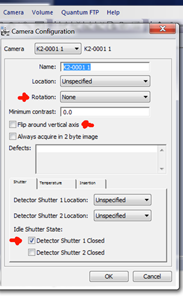

## Gatan K2/K3 are controlled by a computer separated from the microscope

Please read [Using Leginon on a system where the microscope and camera are controlled by different computers](/leginon/Using_Leginon_on_a_system_where_the_microscope_and_camera_are_controlled_by_different_computers) first.

## Extra Package and Installation

- Use all amd64 version of Windows installer

- SerialEM DigitalMicrograph Plug-in

## SEMCCD Digital Micrograph plug-in installation

Thanks to David Mastronarde for providing his DM plug-in using socket connection

## Note: If you have SerialEM installed on the same computer, you don't have to go through this.  The same Plugin can be used by both programs and share the same port

### Remove your older SEMCCDxxxx.dll in  C:\Program File\Gatan\Plugins if you had it from prevous leginon-only installtion

### Download and extract the files

 1. From your browser, go to [[ https://bio3d.colorado.edu/ftp/SerialEM/FrameAlignment/]]
 2. Choose Shrmemframe*..exe for your version of DM to download to your Gatan PC.
 3. Run the downloaded file and follow its instructions.

Add a new environment variable SERIALEMCCD_PORT if not exist already from SerialEM installation. Set the value to an unused port between 50000 and 60000 to avoid conflict with other programs. Avoid ports [used by Leginon](/leginon/Leginon_Manual/Complete_Installation/Network_Configuration/Ports_used_by_Leginon), especially not 55555.

Port 50000 or 50001 usually works.

## instruments.cfg

* A template for instruments.cfg is in the installed pyscope directory as "instruments.cfg.template". Copy it to

C:\Program Files\myami\instruments.cfg

- Remove SimCam modules in the configuration.

The camera modes are configured as separate cameras as follows.

- Super Resolution should be double the size of Linear and Counting.

- zplane will be relative to any other cameras in your system. Anything below K2 should have a lower zplane.
- to make the images acquired from the camera to have the [standard Leginon orientation](/leginon/Leginon_Manual/Instrument_Set-up/Leginon_image_orientation), the camera configuration in Digital Micrograph will need a rotation and flip (270 degree rotation and a flip around the vertical axis on our camera) on typical FEI F20 but maybe not so post-GIF or on Krios. Therefore, **the height is longer than width** in the configuration below

[Gatan K2 Linear]
class: dmsem.GatanK2Linear
zplane: 50
width: 3710
height: 3838

[Gatan K2 Counting]
class: dmsem.GatanK2Counting
zplane: 50
width: 3710
height: 3838

[Gatan K2 Super]
class: dmsem.GatanK2Super
zplane: 50
width: 7420
height: 7676

If you have an Orius camera with K2, set its zplane below K2 like this:

[camera2]
class: dmsem.GatanOrius
zplane: 49
width: 2048
height: 2048

## Setup

- Set camera configuration to give the [standard Leginon orientation](/leginon/Leginon_Manual/Instrument_Set-up/Leginon_image_orientation). For example, we need flip around the vertical axis on FEI T12. Note that the rotation required is different if it is installed post-GIF and/or on Krios.
- Set the [shutter configuration in DM](/leginon/Leginon_Manual/Instrument_Set-up/Low_dose_shutter_configuration_for_Gatan_camera_in_Digital_Micrograph_program) to protect the specimen when camera is not taking images.

-   K2 interface in DM restricts the exposure time to multiple of some set number, depending on the mode. When you enter in DM an invalid number, it automatically change it to the valid one when you click the acquire button. pyscope/dmsem.py has hard-coded values for these precision. Compare them to the precision of the DM version you have since it may change with DM version.
-   K2 frame exposure time is adjustable in Leginon gui. However, you need to check if the number is acceptable by DM using the above method.
-   Create the folder to store the dose fractionation raw frames. Frames are saved as unsigned 16-bit mrc image stack or LZW compressed TIFF (Recommended) in K2 computer under D:\frames by default as set in dmsem.cfg. You must create the frames directory first. Leginon will not do that for you. You may change where the frames are saved here but will need to make corresponding changes when setting up [raw frame file transfer](/leginon/Leginon_Manual/Complete_Installation/Installation_on_the_instrument_computers/Installation_on_the_camera_computer/Direct_Electron_DE-12_direct_detection_device_support/DDD_raw_frame_file_transfer). You can **use X:\frames as the place to save the frame and speed up read/write ONLY IF you can move the frames out in a timely manner**. The camera needs to use this SSD drive during counting. a full disk will cause it to crash.
-   Setup [raw frame file transfer](/leginon/Leginon_Manual/Complete_Installation/Installation_on_the_instrument_computers/Installation_on_the_camera_computer/Direct_Electron_DE-12_direct_detection_device_support/DDD_raw_frame_file_transfer) from a network data server.
-   Unless you want to develop your own frame alignment program. We recommend that you [use Appion to do frame gain correction and alignment](/leginon/appionDirect_Detector_Frame_Processing). These are parallelized by images so it cam almost keep up with the acquisition.

## [older k2 dmsem configuration](/leginon/Leginon_Manual/Complete_Installation/Installation_on_the_instrument_computers/Installation_on_the_camera_computer/Gatan_K2_Summit_Support/Gatan_K2_installation_and_setup/Older_k2_dmsem_configuration)

## Define local configuration in dmsem.cfg

1.  Copy from your myami checkout pyscope/dmsem.cfg.template to C:\Program Files\myami\dmsem.cfg
2.  Make changes to the configured value in dmsem.cfg

Most parameters are explained above.

-   **The config parser takes "'" and "\" literally**. Therefore, do not include "'" in DM_VERION and RAW_FRAME_DIR. In addition, the path separator should be "\"
-   **CAMERA_ID** is usually 0. In the older version, it is defined in the same name below
        class GatanK2Base(DMSEM):

### Early return

Early return speeds up data collection by allowing other processes to proceed until it needs to save another frame movie. To turn this on, you set these values. It only affects frame saving images.

-   **DO_EARLY_RETURN = True**
-   **EARLY_RETURN_FRAME_COUNT = 1** This specifies the number of frames you want to integrate and return to you before all frames are saved. Typically people use 1 so that they still have some idea of the intensity.

The result of using this is that the image found in myamiweb (the integrated image of what you specified as EARLY_RETURN_FRAME_COUNT is not meaningful until you align them through the frame alignment in Appion. With the speed of frame alignment, this is more and more acceptable.

### Saving frame movies as LZW compressed TIFF

-   **SAVE_LZW_TIFF_FRAMES = True** makes it save in compressed tiff file.

## Testing with pyscope

# Start DigitalMicrograph

# From python command line or IDLE:

import pyscope.dmsem
k = pyscope.dmsem.GatanK2Counting()
k.setExposureTime(200)
k.getImage()

You should expect these to run without error. The getImage() command should give a 2D numpy array like

array([[1000, 3400, 2300, ..., 1000,1200,3000],
[1000, 3400, 2300, ..., 1000,1200,3000],
[1000, 3400, 2300, ..., 1000,1200,3000],
...,
[1000, 3400, 2300, ..., 1000,1200,3000],
[1000, 3400, 2300, ..., 1000,1200,3000],
[1000, 3400, 2300, ..., 1000,1200,3000],dtype=int16)

The number and dtype depends on the camera.

a.shape command should give a tuple of the camera dimension matching your camera.
For example, (4096,4096)

**If you use python shell to do this test, some of the error will cause the shell window to close immediately. Use Python IDLE instead in that case**

#### Testing frame saving

You can continue the test above by saving frames, too.

k.setSaveRawFrames(True)
k.setExposureTime(200)
a=k.getImage()
a.shape

- The last command should give you the shape of the summed image, and the frame movie should show up on your frames directory

#### testing energy filter

# Start DigitalMicrograph

# From python command line or IDLE:

import pyscope.dmsem
k = pyscope.dmsem.GatanK2Counting()
k.getEnergyFiltered()
k.getEnergyFilter()
k.setEnergyFilter(True)
k.getEnergyFilter()
k.setEnergyFilter(False)
k.getEnergyFilter()
k.getEnergyFilterWidth()

## Trouble shooting

SerialEM-CCD plugin can output the command it issues and results to DM's result panel if you set the environment variable SERIALEMCCD_DEBUG to 2. Please activate this debug log and include the portion that shows problem when reporting problems to Leginon team.

## Programs to open before Leginon Client: Digital Micrograph

## See more about K2 implementation in [Using Gatan K2 Summit in Leginon](/leginon/Leginon_Manual/Complete_Installation/Installation_on_the_instrument_computers/Installation_on_the_camera_computer/Gatan_K2_Summit_Support/Using_Gatan_K2_Summit_in_Leginon)
