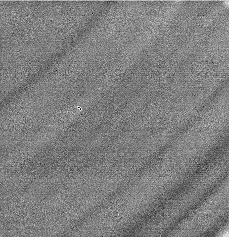

K2 Summit in counted/super-resolution mode has two layers of gain reference correction, known as hardware (HW) correction and software correction.

Hardware dark correction is essential for electron counting, without it, its processor can not find individual electrons.
Hardware gain correction is a rough gain correction. It is only done to make sure the data from different ADC boards are reasonably normalized before counting.

After these hardware correction and counting, the images are integers, representing the number of counts received at each pixel. We call this type of data "raw".

Software dark correction for counted/super-resolution mode is fake. The image taken in dark condition is set to 0 internally and output as such if a dark exposure is requested externally by SerialEM and Leginon.
Software gain reference taken in DM is equivalent to the bright image taken in Leginon. The software gain correction, as well as Leginon's correction use this image of the blank area to normalize the more subtle differences from pixel to pixel.

After this level of gain normalization, the image data type is float.

**Since Leginon duplicates the DM software gain normalization, we decided to receive images from DM without software gain normalization. This is set in the code, and means gain correction is still needed in Leginon**.

1.  The hardware correction has been applied in DM before counting. Therefore, the "raw" image Leginon get are integers and roughly gain corrected.
2.  The dark image in Leginon should always be 0. Therefore, acquiring dark image only need to be done once per camera configuration. There is also no need to average several images in the making.
3.  The bright image acquired in Correction node should be taken at the dose rate to be used. It should also be taken so that accumulated exposure time is at least 100 second (DM reference accumulates 500 seconds of exposure by taking 50 of 10 second exposure). If you don't want to wait this long, a reasonably good reference can normally be obtained with averaging 20 of 5 second exposure. Alternatively, take a single very long exposure (100 s).

The bright image will display variation in sensitivity of the pixels. There is likely a general gradient across the detector known as growth zone like this attached image:

### Frame Saving

When frames are saved:

-   The image returned to Leginon gui and saved as usual IS gain normalized by Leginon as usual. This is an integration over all the frames. With the gain correction, the image is 32-float mrc image.

-   The movie frames recorded are "raw" as defined above. This saves some time and keeps the file at 1/2 the size. The format is 16-bit integer MRC image stack. We plan to save in the future even smaller number of bits. Appion will use the bright/dark/correction plan of the image transferred to Leginon to make corrected frame during [frame stack making](/leginon/appionGainDark_correction_of_the_raw_frame_with_or_without_drift_correction).

### Linear mode (Not recommended as we found the quality is unstable)

1.  The dark image will have a large mean and the value changes with exposure time. Ideally, the dark images should therefore be taken at the same exposure time as the later images to be corrected. Leginon can account for small differences but not a full range.
2.  To avoid saturation by the accumulated dark current, long exposure in linear mode is not recommended. 0.5 s is typical.
3.  Do not use frame saving with linear mode. It is not worth while.
