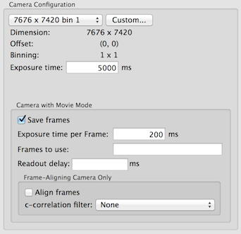

1.  Typical frame saving preset parameters for counted/super-resolution: 0.2 s frame exposure time, 4-5 s total exposure time at 8-10 e/physical pixel/s (Some argues that 5 e/physical pixel/s is better). You can use DM's reading of dose rate while it is in counted mode and **UNBINNed** to get a reasonable estimate.

## Camera configuration for frame saving

1.  "Exposure time" specifies the total time in which the frames are saved.
2.  "Frame time" defines the length of each frame. The minimal value is 50 ms for K2 Summit and the values must be multiple of 50 ms.
3.  "Frames to use" is not used
4.  "Readout Delay" is not used

## File location:

The raw frame files can be saved in one of the three locations. Which one to use is determined by the speed and space since the data acquisition can not continue during the frame saving.

The rawtransfer.py script described in [DDD raw frame file transfer](/leginon/Leginon_Manual/Complete_Installation/Installation_on_the_instrument_computers/Installation_on_the_camera_computer/Direct_Electron_DE-12_direct_detection_device_support/DDD_raw_frame_file_transfer) will do an rsync and/or file rename once the frame files are saved with minimal delay to data acquisition.

1.  K2 computer X:\frames\ Use this if you set up rawtransfer.py to transfer and remove files on the drive fast enough that there is no accumunation during data collection. K2 camera uses X drive for processing the frames. It is therefore important not to fill it up.
2.  K2 computer D:\frames\ Use this if file transfer is slow and network drive mounting is not stable. This ensures that frames are saved and can handle some accumulation of data.
3.  Network file server mounted on K2 computer.

The file location is determined in pyscope/dmsem.py constant RAW_FRAME_DIR. For example:

    K2_FRAME_DIR =  'D:\frames

You must create this parent directory manually before start saving the frames.

Each set of raw frame is saved in mrc format as an image stack identified by the date and a unique number. This is set by Leginon in pyscope/dmsem.py.
Leginon retrieve this and saved in its database so that [rawtransfer.py](/leginon/Leginon_Manual/Complete_Installation/Installation_on_the_instrument_computers/Installation_on_the_camera_computer/Direct_Electron_DE-12_direct_detection_device_support/DDD_raw_frame_file_transfer) script can transfer it to the Leginon rawdata directory under the same session.

## Next: [Transfer and/or rename the movie frames](/leginon/Leginon_Manual/Complete_Installation/Installation_on_the_instrument_computers/Installation_on_the_camera_computer/Direct_Electron_DE-12_direct_detection_device_support/DDD_raw_frame_file_transfer)
