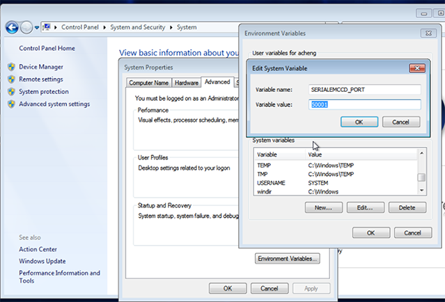

dmsem module uses SEMCCD.dll written for SerialEM to communicate with Gatan software rather than tecnaiccd.dll

If using this on a computer different from the scope computer, please read [this](/leginon/Using_Leginon_on_a_system_where_the_microscope_and_camera_are_controlled_by_different_computers) first.

## Extra Package and Installation

-   Use all win32 version of Windows installer if this is an Windows-32 PC. Otherwise install the 64-bit version.

-   SerialEM DigitalMicrograph Plug-in

Thanks to David Mastronarde for providing his DM plug-in using socket connection

## Note: If you have SerialEM installed on the same computer, you don't have to go through this.  The same Plugin can be used by both programs and share the same port

### Remove your older SEMCCDxxxx.dll in  C:\Program File\Gatan\Plugins if you had it from prevous leginon-only installtion

### Download and extract the files

 1. From your browser, go to [[ https://bio3d.colorado.edu/ftp/SerialEM/FrameAlignment/]]
 2. Choose Shrmemframe*..exe for your version of DM to download to your Gatan PC.
 3. Run the downloaded file and follow its instructions.

Add a new environment variable SERIALEMCCD_PORT if not exist already from SerialEM installation. Set the value to an unused port between 50000 and 60000 to avoid conflict with other programs. Avoid ports [used by Leginon](/leginon/Leginon_Manual/Complete_Installation/Network_Configuration/Ports_used_by_Leginon), especially not 55555.

Port 50000 or 50001 usually works.

## instruments.cfg

Currently UltraScan and Orius camera are supported.

For UltraScan camera (US4000), set instruments.cfg to use GatanUltraScan class. For example:

    [us4000]
    class: dmsem.GatanUltraScan
    zplane: 50
    height: 4096
    width: 4096

For Orius camera, set instruments.cfg to use GatanOrius class.

## Setup

- Set camera configuration to give the [standard Leginon orientation](/leginon/Leginon_Manual/Instrument_Set-up/Leginon_image_orientation). For example, we need flip around the vertical axis on FEI T12. Note that the rotation required is different if it is installed post-GIF and/or on Krios.
- Set the [shutter configuration in DM](/leginon/Leginon_Manual/Instrument_Set-up/Low_dose_shutter_configuration_for_Gatan_camera_in_Digital_Micrograph_program) to protect the specimen when camera is not taking images.

## Define local configuration in dmsem.cfg

1.  Copy from your myami checkout pyscope/dmsem.cfg.template to C:\Program Files\myami\dmsem.cfg
2.  Make changes to the configured value in dmsem.cfg

Most parameters are explained above.

-   **The config parser takes "'" and "\" literally**. Therefore, do not include "'" in DM_VERION. In addition, the path separator should be "\"
-   **CAMERA_ID** is usually 0 if it is the only Gatan camera.
-   *Ultrascan camera should be configured under utrascan module, and Orius camera should be configured under orius module.

For example, only UltraScan camera exists on this computer that has Digital Micrograph version 2.32.788.0, and DM camera configuration
has vertical flip but no rotation, then set the dmsem.cfg ultrascan module like this:

    [dm]
    DM_VERSION = 2.32.788.0

    [ultrascan]
    CAMERA_ID = 0
    FLIP = True
    ROTATE = 0

## Testing with pyscope

1. Start DigitalMicrograph

2. From python command line

from pyscope import dmsem
d = dmsem.GatanUltraScan()
d.getImage()

You should expect these to run without error. The getImage() command should give a 2D numpy array like

array([[1000, 3400, 2300, ..., 1000,1200,3000],
[1000, 3400, 2300, ..., 1000,1200,3000],
[1000, 3400, 2300, ..., 1000,1200,3000],
...,
[1000, 3400, 2300, ..., 1000,1200,3000],
[1000, 3400, 2300, ..., 1000,1200,3000],
[1000, 3400, 2300, ..., 1000,1200,3000],dtype=int16)

The number and dtype depends on the camera.

a.shape command should give a tuple of the camera dimension matching your camera.
For example, (4096,4096)

**If you use python shell to do this test, some of the error will cause the shell window to close immediately. Use Python IDLE instead in that case**

## Trouble shooting

### Refused socket connection

### Refused socket connection for SERIALEMCCD_PORT

If an error of "No connection could be made because the target machine actively refused it" comes up in the above test, it could be one of the two reasons:

1. blocked by firewall
2. blocked by a still active broken attempt
3. blocked by an unrelated process after system upgrade by Gatan or some automated process

#### Blocked by Firewall

You should add this to [ports used by Leginon](/leginon/Leginon_Manual/Complete_Installation/Network_Configuration/Ports_used_by_Leginon) to be added to firewall exception port list if leaving the firewall on.

#### Blocked by a still active broken attempt

You can check active tcp port with Windows command

netstat

- In some case, you will find SERIALEMCCD or similar listed in Windows Task Manager Processing list. If so, and that process remains after Digital Micrograph is closed, you can terminate it from Task Manager.
- CurrPorts is a program that can be used to check and close socket tcp connection with gui.

#### Blocked by an unrelated process

After a general software upgrade, it is possible that the upgraded software decided that this is the port it needs and block our connection to the port. The ports after 49153 is consider free ports for any program to use. Therefore, the only way for us to solve this problem is to move to another unused port. Use CurrPorts to find an unused port and assign it should resolve the problem.

### SerialEM-CCD plugin can output the command it issues and results to DM's result panel if you set the environment variable SERIALEMCCD_DEBUG to larger than 0. Set to 1 to show general log. Set to 2 to also include socket communication log. Please activate this debug log and include the portion that shows problem when reporting problems to Leginon team.

## Programs to open before Leginon Client: Digital Micrograph
