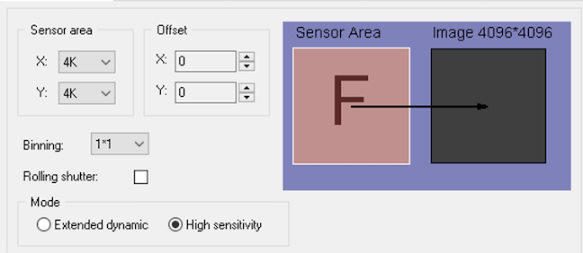
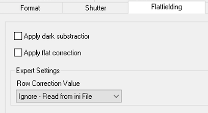

## Many Tietz cameras are controlled by a computer separated from the microscope

Please read [Using Leginon on a system where the microscope and camera are controlled by different computers](/leginon/Using_Leginon_on_a_system_where_the_microscope_and_camera_are_controlled_by_different_computers) first.

## Extra Package and Installation

  package                       pip installation version
  ----------------------------- -------------------------------
  CAMC4.exe                     (Should come with the camera)
  comtypes for 64-bit machine   1.1.7

install comtypes 1.1.7 from cmd terminal (internet connection needed)
or you can go through steps to save the download on another computer (google search pip download) and then copy it to the scope computer to install.

    pip install comtypes==1.1.7

## Run updatecom.py

-   From a command line window:
        cd C:\python27\Lib\site-packages\pyscope
        C:\python27\python.exe checkcom.py

-   The output sould contain this output
        checking TVIPS EmMenu
        Found COM typelib named: EMMENU4.EMMENYApplication.1

You can ignore error messages regarding other com modules.

## Create Leginon Viewport

EM-Menu use saved and loaded viewports to set preset configuration. In order not to disturb its other behavior, Leginon
uses a specific named viewport when it controls the camera.

1. Open EM-Menu on TVIPS computer. The last configuration and view port used is typically appeared and activated.

2. Select viewport 1 if it is not yet selected from Window menu. The number at the window name is the viewport id. Here is an example of what you may select if there are multiple viewports opened.

3. Select from menubar Camera/Configuration Manager ...

4. Click New to create a configuration, name it Leginon

Here is an example:

- Format

- Shutter

- Flatfield

5. Save the current configuration list as a backup.

5. close the dialog and reopen by repeating step 3. Leginon should either be selected or at least listed as an existing configuration.

## Testing

1. Close EM-Menu and then reopen. Use step 2-3 in the previous section to check if the new viewport is loaded.

## instruments.cfg

Current available classes are

    ##   - tietz2.EmMenuF416
    ##   - tietz2.EmMenuF416_GPU (gpu functions not implemented
    ##   - tietz2.EmMenuF216

For example, instruments.cfg for F416 looks like this:

    [Tietz Camera]
    class: tietz2.EmMenuF416
    zplane: 5
    height: 4096
    width: 4096

-   I use zplane of 5 because this is a bottom-mount camera that does not retract. Therefore it is always the lowest.

## Setup tvips.cfg

* A template for tvips.cfg is in the installed pyscope directory as "tvips.cfg.template". Copy it to

C:\Programs\myami\instruments.cfg

-   Unless you plan to use the unreleased recorder functions, just leave that part as default.

## Testing with pyscope

**F416 camera is used in this case**

1. Open TVIPS TCL/EMMENU
2. From python command shell or IDLE:

    from pyscope import tietz2
    t = tietz2.EmMenuF416()
    a=t.getImage()
    a.shape

You should get (4096,4096) matching the camera dimension.

If you do

    print a

you get

You should expect these to run without error. The getImage() command should give a 2D numpy array like

array([[1000, 3400, 2300, ..., 1000,1200,3000],
[1000, 3400, 2300, ..., 1000,1200,3000],
[1000, 3400, 2300, ..., 1000,1200,3000],
...,
[1000, 3400, 2300, ..., 1000,1200,3000],
[1000, 3400, 2300, ..., 1000,1200,3000],
[1000, 3400, 2300, ..., 1000,1200,3000],dtype=int16)

The number and dtype depends on the camera.

a.shape command should give a tuple of the camera dimension matching your camera.
For example, (4096,4096)

**If you use python shell to do this test, some of the error will cause the shell window to close immediately. Use Python IDLE instead in that case**

## Trouble shooting

## Programs to open before Leginon Client: None. EMMENU must be opened
