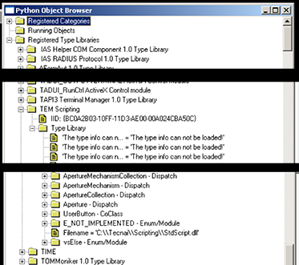

There are two possible reason for this failure on FEI scopes

## TEM Scripting is not activated on this microscope

Ask your FEI engineer about it.

## TEM Scripting is not registered properly

This usually happens because something has overwritten it incorrectly. This can be fixed by registering it.

In this example, we want to find the dll for TEM Scripting and register it.

## Find the dll file for the type library.

1. Navigate to C:\Python27\Lib\site-pacakges\pythoncom\client
2. Open combrowse.py
3. Expand Registered Type Libraries and find "TEM Scripting"
4. Expand "Type Library" under TEM Scripting"
5. You should find at the end of the list "Filname: 'C:\Tecnai\Scripting\StdScript.dll'

## Register the dll

With Windows comand line terminal

cd C:\Tecnai\Scripting
regsvr32 StdScript.dll

