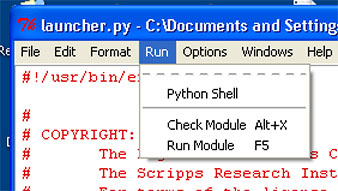

Running python script on Windows has one general problem: If there is an exception running the script, it closes the python command window immediately and therefore not possible to see what went wrong. One way to make sure the exceptions and traceback can be read is to use Python IDLE GUI.

1. Right click the script you would like to test and choose to edit that with IDLE. You should get two windows, one of them show the script that can be edited, and the other similar to the command line interface.

2. Click "Run Module" under "Run" Toolbar to run. The results and traceback for error if any will show up in the command window.

