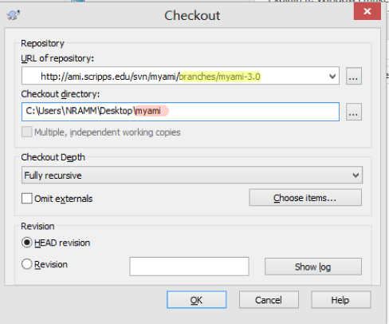

Use your mouse to do the following

-   Create a folder at your convenience to gather all download files. Let's call it myami-VERSION where VERSION would corresponds to your check version. For example, myami-3.1 for 3.1 release

-   Change directory into myami-VERSION

-   Right-click the mouse botton in this directory window and select Tortoise svn
    Checkout in the menu:
    

-   Set up svn checkout window like this but change shaded area according to the version you want and the destination.
-   We recommend that you put the destination to myami-VERSION\myami so that it is easy to recognize in the future.

Note: the URL has changed to http://emg.nysbc.org/svn/myami/branches/myami-3.2

See [Acquiring NRAMM SVN Repository files](/leginon/Download_Appion_Files) for different examples and match the repository with what you do on the Linux side.
