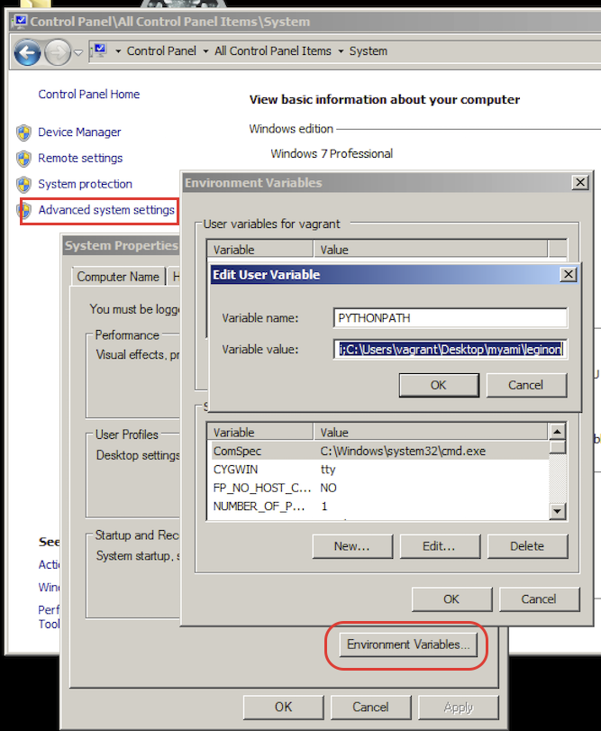

-   You need to repeat installation of the general packages for each of the computer involved in Leginon operation with addition for the camera and scope.

## Install Python and supporting packages with their installers. **Only Gatan K2/K3 computer uses 64-bit version of python**.

------------------------------------------------------------------------

Program package web site local copy of win32 installer local copy of amd64 installer
Python > 2.7.10 <http://www.python.org> python-2.7.16.msi python-2.7.18.amd64.msi
wxPython 2.8 or newer <http://www.wxpython.org> wxPython2.8-win32-unicode-2.8.12.1-py27.exe wxPython2.8-win64-unicode-2.8.12.1-py27.exe
MySQL Python client 1.2 or newer <http://sourceforge.net/projects/mysql-python> MySQL-python-1.2.4b4.win32-py2.7.exe MySQL-python-1.2.3.win-amd64-py2.7.exe
Python Imaging Library (PIL) 1.1.4 or newer <http://www.pythonware.com/products/pil/> PIL-1.1.7.win32-py2.7.exe PIL-fork-1.1.7.win-amd64-py2.7.exe
NumPy (use only from our file to match compiled numextension numpy-1.7.0-win32-python2.7.exe numpy-MKL-1.6.2.win-amd64-py2.7.exe
SciPy 0.5.1 or newer <http://www.scipy.org> scipy-0.11.0-win32-superpack-python2.7.exe scipy-0.11.0.win-amd64-py2.7.exe
------------------------------------------------------------------- ------------------------------------------------------------------------------------ ---------------------------------------------------------------------------------------------------------------------------------------------------------------------------------------------- ----------------------------------------------------------------------------------------------------------------------------------------------------------------------------------------------

Use pyMySQL for leginon 3.6 and above instead of MySQL Python client for both win32 and 64.
|pyMySQL 0.10.1 (not higher)|https://pypi.org/project/PyMySQL/|pyMySQL-0.10.1-py2.py3-none-any.whl

Excute the installer files and follow the instructions.

## Add the IP address and matching hostname of the microscope and digital camera computer in your host file on the main Leginon computer, and vice versa.

### Find out what python thinks the hostname is with python command line. REPEAT this both on Linux and Windows PC

Run the following in python command line:

import socket
socket.gethostname()

### Find out the ip address associated with the hostname

Run the following in python command line:

import socket
socket.gethostbyname('your_host_name')

### Modify your "hosts" file on the linux Leginon computer to include the instrument hosts if the latter is not already mapped by your domain name server

- On Linux, this "hosts" file is at
> /etc/hosts

Example of a "hosts" file:

192.000.1.222 instrument_host_name.domain_name instrument_short_host_name

### Use shorter linux hostname if desired

If you'd like to shorten your linux hostname recognized by socket without the domain name, you may do so as root

hostname your_shorter_hostname

and also add that to the /etc/hosts as an alternative name

192.000.1.333 long_host_name.domain_name your_shorter_hostname

You will need to restart networking to make it persistent.

/etc/init.d/network restart

Test the change by finding the ip address with the hostname as in the above section.

### The Linux main Leginon computer also needs to identify itself by its hostname registered on the instrument Windows computer.

- On Window XP and WIndows 7 this host file is
> C:\WINDOWS\system32\drivers\etc\hosts

- On Window NT, this host file is
> C:\WINNT\system32\drivers\etc\hosts

## What to do if host-ip mapping still does not work: [configure pyamicfg for host-ip pairings](/leginon/Leginon_Manual/Start_Leginon/Test_Network_Connection_Between_Remote_and_Instrument_Computers/Configure_pyamicfg_for_host-ip_pairings)

## Install the Windows Installer Files from created from source by NRAMM

Package win32 amd64
--------------------- ------------------------------------------------------------------------------------------------------------------------------------------------------------------------------ ------------------------------------------------------------------------------------------------------------------------------------------------------------------------------------------
numextension numextension-svn.win32-py2.7-numpy1.7.0.exe numextension-svn.win-amd64-py2.7-numpy1.6.2.exe

Execute the installer files and follow the instructions.

## Install [the packages you cloned from NRAMM git repository](/leginon/Leginon_Manual/Complete_Installation/Installation_on_the_instrument_computers/Windows_Package_Requirement_30#Cloning-myami-git-repository) (You will need to repeat this each time you upgdate)

The git checkout is a folder containing several subpackages. You will install the python packages using python installer. **See the next section if you want to use directly do git checkout**.

## These are the subpackages

  Name:         Purpose:
  ------------- -----------------------------------
  pyami         general functions
  myami_test    test suite
  sinedon       database interaction
  leginon       modular TEM image acquisition
  pyscope       microscope control and monitoring
  imageviewer   image viewing for tomography

If you recall Linux processing server installation instruction, this is a bit different. Numextension and LibCV are not included. Numextension is already installed with windows installer. libcv and opencv are not required by Leginon client that this part installation is aimed for.

-   Start a command line Window from Start Menu

-   Install the package in each folder with commands such as
        cd path_to\myami-VERSION\myami\pyami
        c:\python27\python.exe setup.py install

    
    Then continue with the other packages, replacing pyami with the package name. See "These are the sub-packages of myami that you will install with the python installer." section above for complete list.

## (Alternative approach, easy for updating) Set environment variable PYTHONPATH to use svn checkout or git clone directly

## Set pythonpath environment variable for local myami sandbox

For an uninstall myami svn checkout, you can set PYTHONPATH environment variable to use it directly.

1. Control Panel\All Control Panel Items\System> click on Advanced settings
2. System Properties\Advanced> click on Environment Variables
3. Either create a new variable for the current user, or do it system-widely.

PYTHONPATH should incldue both the base myamipath as well as leginon

For example, myami folder is at C:\Users\vagrant\Desktop\myami, then the python path should be set as follows:

C:\Users\vagrant\Desktop\myami; C:\Users\vagrant\Desktop\myami\leginon

[< Package Requirement](/leginon/Leginon_Manual/Complete_Installation/Installation_on_the_instrument_computers/Windows_Package_Requirement_30) | [Additional installation specific to the microscope >](/leginon/Leginon_Manual/Complete_Installation/Installation_on_the_instrument_computers/Installation_on_the_microscope_computer_30)
