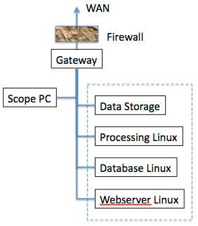
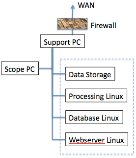
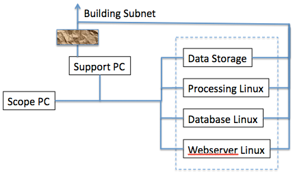
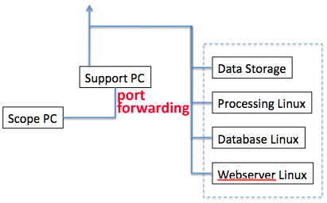

Each host that requires Leginon communication do so through TCP. Here are some useful links.

## [Ports used by Leginon](/leginon/Leginon_Manual/Complete_Installation/Network_Configuration/Ports_used_by_Leginon)

## [Test Network Connection Between Remote and Instrument Computers](/leginon/Leginon_Manual/Start_Leginon/Test_Network_Connection_Between_Remote_and_Instrument_Computers)

At NRAMM, our microscope, Leginon processing server, Database server, and Webserver are all within the same and reliable firewall provided by its gateway. We turn off the Windows firewall on the scope PC in this case. The assumption used in this configuration is that computers within the bound of the gateway is safe. This allows all computers in the lab access to the data collected.

Some of the FEI microscopes come with a "support PC" which acts as gateway to the scope PC and prevents the latter direct internet access. The easiest set up is then put the Leginon system within that local network. This has the drawback that Leginon web viewing as well as the data collected are only accessible in the local network (typically in the same room).

For most security, your building subnet should be firewall protected, like what we have at NRAMM. In this case,
you can either by-pass the support PC, install a second network card on Leginon system to use that to isolate the scope PC from outside,

or do port-forwarding on the support PC.
**This configuration requires that support PC opens up a few ports towards outside which a lot of building firewall will not allow. After trying this configuration recently at one site, we feel this adds more security risk than benefit. If your local scope service engineer insists on it, you should consider installing a third network card on the support PC to do this and leave the internet network alone**.

Here is [an example provided by a user](/leginon/Leginon_Manual/Complete_Installation/Network_Configuration/An_example_of_working_port-forwarding_configuration)

Here are some extra information if you know how and want to further configure.

1.  [Ports used by Leginon](/leginon/Leginon_Manual/Complete_Installation/Network_Configuration/Ports_used_by_Leginon)
2.  Leginon bulletin board thread on [Network problem - Leginon not seeing tecnai host](http://emg.nysbc.org/redmine/boards/6/topics/3).

## Troubleshooting network between main leginon processing server and TEM host:

1.  Try to ping TEM host from Leginon host using host name (not IP). If host name does not work, then you need to configure either your DNS server or your /etc/hosts file to know the host name to IP mapping.
2.  Pay attention to whether you need to use the fully qualified name, for example "myhost.scripps.edu" rather than just "myhost". If that is the case, then you must also use the fully qualified name in Leginon when connecting to clients.
3.  Try to ping Leginon host from TEM host. Again, you may need to adjust host name mapping. On Windows, there is "/etc/hosts" but it is located in a strange place: C:\Windows\System32\Drivers\etc\hosts. The first part of that may be slightly different depending on version of Windows.
4.  Follow the tests described in [Test Network Connection Between Remote and Microscope Computers](/leginon/Test_Network_Connection_Between_Remote_and_Microscope_Computers)

[< Select Linux distribution to use](/leginon/Leginon_Manual/Complete_Installation/Select_Linux_distribution_to_use) | Manual Installation: [Where to register and download Leginon >](/leginon/Leginon_Manual/Complete_Installation/Where_to_register_and_download_Leginon)

[< Select Linux distribution to use](/leginon/Leginon_Manual/Complete_Installation/Select_Linux_distribution_to_use) | Auto Installation: [Autoinstaller for CentOS >](/leginon/Leginon_Manual/Complete_Installation/Autoinstaller_for_CentOS)
