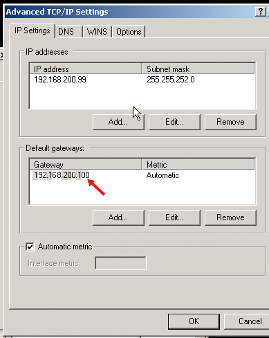
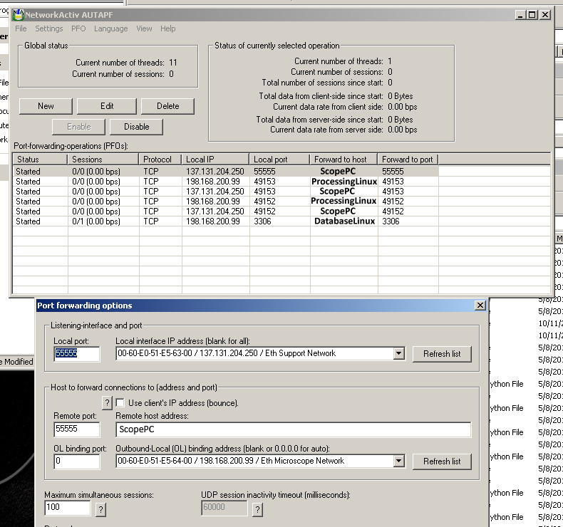

## Recent configuration using linux workstation to do the forwarding.

See Feature Issue #7491 for documentation and scripts provided by Bill Rice.

## (Paraphrased from description by Brian J. Gibbens) and tested at NRAMM

Local network (192.168.xxx.xxx in this example) can not be accessed directly through
institute network that has internet access before port forwarding.

## The computer hosts involved in this port-forwarding configuration listed by hostname and operation system in ( ):

1.  **ScopePC** (Windows) - The computer controlling the microscope
    -   connected only to local network
    -   Static local IP addresses (192.168.200.99 in this example) is set to this host.
2.  **SupportPC** (Windows) - The computer provided by FEI to protect **ScopePC** while allow RAPID system support from them through internet.
    -   Two network cards are on this computer.
    -   Local network Static IP address (192.168.200.100 in this example)
    -   Outbound institute network Static IP address (137.131.204.250 in this example)
3.  **ProcessingLinux** (Linux) - The computer that runs Leginon processing.
    -   Institute network Static IP address (137.131.204.500 in this example)
4.  **DatabaseLInux** (Linux) - The computer that runs Leginon database server. In a simpler setup this might be the same computer as the ProcessingLinux as illustrated in the figure below.
    -   Institute network Static IP address (137.131.204.700 in this example)

**Ethernet cables should be connected like in the figure above.**

## TCP/IP Gateway Settings on **ScopePC** This should be set to the local IP address of the **SupportPC** like this: 

## Firewall settings on **SupportPC**

allow communication to **ScopePC** and **ProcessLinux** and **DatabaseLinux**.

## Hosts file addition if needed

---Appropriate IP addresses and hostnames added to the hosts files
(C:/WINDOWS/System32/drivers/etc/hosts.txt on Windows PC's and
/etc/hosts on Linux).

-   On **ScopePC** - list hostnames of **SupportPC**, **DatabaseLinux** and **ProcessingLinux**
-   On **SupportPC** - list both hostnames of **ScopePC** and **DatabaseLinux** and **ProcessingLinux**
-   On **ProcessingLinux** and **DatabaseLinux** - list hostname of **SupportPC** in additional to other linux hosts but not **ScopePC** since all communication from **ScopePC** to these through **SupportPC** will appear to come from **SupportPC**

## Install port forwarding program AUTAPF which allows needed host/port specification on **SupportPC**

The screen shot below shows that case where:

-   Port 55555 is opened by legion/laumcher.py (often called Leginon Client") on **ScopePC**, intended to serve data to **ProcessingLinux**. (Fixed port)
-   Ports 49152 and 49153 are opened by two processes to send/receive data to *ScopePC". (You may need to add more ports in case of blockage. See [Ports used by Leginon](/leginon/Leginon_Manual/Complete_Installation/Network_Configuration/Ports_used_by_Leginon))
-   Port 3306 is dedicated for database connection. (Fixed port)

# Another account of setting up port forwarding

Based on the experiences of Morgan Beeby at Imperial College London, late 2014 / early 2015.

In my experience, setting up Leginon on a microscope hidden behind a support PC is relatively straightforwards as long as you are fairly painstaking at each step. Here is my experience distilled from a couple of installations.

Essentially the support PC is bridging between two networks, both of which it is connected to: the Microscope subnetwork and the wider LAN.

-   Install Leginon server on the CentOS 6.5 server PC
-   Install Leginon on the microscope PC using a memory stick to transfer files
-   Work out the following information, and write it down precisely:
    -   Microscope PC parameters:
        -   Hostname: run python, and type:
            -   import socket
            -   socket.gethostname()
        -   IP address on the Microscope subnetwork: at C: prompt, type:
            -   ipconfig/all
    -   Support PC parameters:
        -   IP address for the support PC on both the Microscope subnetwork, and wider LAN: at C: prompt, type:
            -   ipconfig/all
    -   Leginon server machine parameters:
        -   Hostname:
            -   import socket
            -   socket.gethostname()
        -   IP address on the wider LAN:
            -   Type ifconfig in terminal
-   Install the commercial version of AUTAPF on the support PC
-   Configure the Microscope PC
    -   c:/WINDOWS/system32/drivers/etc/hosts
        -   Add a line with the Support PC's IP address and the Leginon server's hostname, separated by spaces. For example:
            -   192.168.1.1 leginon
        -   Edit c:\Program Files\myami\sinedon.cfg so that 'host' reflects the Leginon server hostname
-   Configure support PC
    -   Edit c:/WINDOWS/system32/drivers/etc/hosts and add lines listing:
        -   The leginon server IP address on the wider LAN against its hostname,
        -   The microscope PC's IP address on the microscope subnetwork against its hostname
    -   Configure AUTAPF on the Support PC

  Local IP                             Local port   Forward to host       Forward to port
  ------------------------------------ ------------ --------------------- -----------------
  Support PC IP (wider network)        55555        Microscope hostname   55555
  Support PC IP (microscope network)   49153        Leginon hostname      49153
  Support PC IP (microscope network)   49154        Leginon hostname      49154
  Support PC IP (microscope network)   49155        Leginon hostname      49155
  Support PC IP (microscope network)   49156        Leginon hostname      49156
  Support PC IP (microscope network)   49157        Leginon hostname      49157
  Support PC IP (microscope network)   49158        Leginon hostname      49158
  Support PC IP (microscope network)   49159        Leginon hostname      49159
  Support PC IP (microscope network)   49160        Leginon hostname      49160
  Support PC IP (microscope network)   49161        Leginon hostname      49161
  Support PC IP (microscope network)   49162        Leginon hostname      49162
  Support PC IP (wider network)        49153        Microscope hostname   49153
  Support PC IP (wider network)        49154        Microscope hostname   49154
  Support PC IP (wider network)        49155        Microscope hostname   49155
  Support PC IP (wider network)        49156        Microscope hostname   49156
  Support PC IP (wider network)        49157        Microscope hostname   49157
  Support PC IP (wider network)        49158        Microscope hostname   49158
  Support PC IP (wider network)        49159        Microscope hostname   49159
  Support PC IP (wider network)        49160        Microscope hostname   49160
  Support PC IP (wider network)        49161        Microscope hostname   49161
  Support PC IP (wider network)        49162        Microscope hostname   49162
  Support PC IP (microscope network)   3306         Leginon hostname      3306

* In AUTAPF, click PFO > Enable All.

-   Configure the Leginon server PC
    -   Edit /etc/hosts files: Add Support PC IP address on the wider LAN and the microscope PC's hostname, e.g.:
        -   12.69.34.123 Tecnai-12345678

[Go up](/leginon/Leginon_Manual/Complete_Installation/Network_Configuration)
