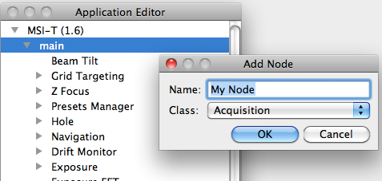

1.  Start a leginon session
     
2.  Select Menu/Application/Edit...> to start a new application
     
3.  Or Select Menu/Application/Load> to load an existing application for editing
     
4.  Save the application through Application/Save> or Save As>

## What you can do:

### Create a new application based on an existing one

## The reason for doing so is to keep settings separate among different scopes and camera, so that you don't have to change settings every time you switch scopes.

Leginon settings are defined by the node class and the instance name (called node alias in Application Editor), not by application. Therefore, you can setup your presets in "Presets Manager" node of Calibrations application and then close that and get the same presets in "Presets Manager" node of MSI-T application.

1.  Load the existing application
2.  Rename the application
3.  Make changes of node alias, binding and etc.

To save the change as another application:

1.  After the change, click on any other item so that gui register the change.
2.  Save the application from menu.
    **OR**
3.  Left click Application/Save As> and check the application name before confirmation.

### Rename an application, a launcher, or a node

First selecting the item with left click and then click on it again to edit.

### Use a different node class for an existing node alias

For example, you have a good Application that uses JAHCHoleFinder (the hole template finder). You want to replace the JAHCFinder of Exposure Targeting Node to RasterFinder class.

1.  left click the node in the application loaded in Application Editor
2.  right click on it to get Property dialog (similar to Add Node dialog below but says Node Properties in the title)
3.  Select your desired Class field and accept it with OK button.
4.  left click on the Application name and change it.
5.  After the change, click on any other item so that gui register the change.
6.  Save the application from menu as described above.

### Add a Launcher.

Right-click and hold on the name of the application to select "Add Launcher".

Rename the launcher to your choice by selecting the launcher name with left click and then click on it again to edit

### Add a node within a Launcher.

Right-click on the launcher to select "Add Node"

Enter an descriptive Alias name for the node. For example, "Instrument" for the "EM" node.

Choose the Node Class from the pull-down list.

### Add Event Bindings between nodes.

Right-click on the node the event binding is originated from to select "Bind Event..."

Add a Presets Manager node aliased as "pm" in the same launcher.

Select in the pull-down menu where the event is bound to under "To Node".

Select the event to bind from the pull-down list of the valid event bindings.

[Edit an existing application as an xml file >](/leginon/Leginon_Manual/Create_and_Edit_Applications/Edit_an_existing_application_as_an_xml_file)
