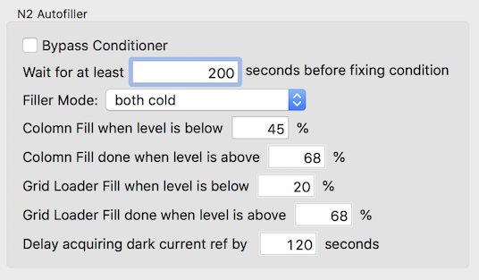

This data collection correct the coma and stigmatism that is linearly dependent on the distance of beam-image shift. It allows quality approaching stage shift approach but even higher image-shift image range than previously acceptable. In this particular setup and microscope, up to 36 1.2/1.3 gold foil holes can be taken in one hl image that requires one auto focus. The pixel size used is significantly smaller than previous setup shown to increase S/N ratio at the same resolution. FSC 0.143 is at 1.92 A.

The resolution and speed gain relative to previous image-shift data collection is from

1.  single construct of the recombinant apoferritin and better purification. Plasmid is from Haruaki Yanagisawa, Protein expression and purification by Brian Kloss
2.  grid preparation with thin ice. Prepared by Laura Yen
3.  beam-image-shift aberration correction allows larger shift at the same quality of data collection as stage shift but a fraction of time in stepping through.

**IMPORTANT**: The number of holes can be imaged depend on the scope-camera configuration. Some scope may show too much image distortion at low magnification for accurate targeting.

## Instruments

SEMC@NYSBC Krios1

1.  Scope: FEI Titan-Krios, 300 kV, micro probe at low mag, nano probe at high mags
2.  Camera: Gatan K2. mount below Falcon/Ceta. 0.66 Å at 37kx scope nominal mag

## Grid

-   1.2/1.3 C-flat carbon support coated with gold; 400 mesh Copper grid.

1.  Krios-K2 Presets used for 1.9 A mouse recombinant apoferritin reconstruction data collection at SEMC @ NYSBC

The same as [Krios1-K2-NYSBC](/leginon/Sub-3Å_proteasome_image-shift_data_collection/Krios1-K2-NYSBC) except

Probe Lens Series Magnification: Preset name: Image Shift (x,y): Dimension: Binning: Camera Dose (e/camera pixel/s): Exposure Time (ms): Specimen Dose Rate (e/A^2): Spot Size: Defocus (m): C2 (um): frame saving: Camera
---------- ------------------- ------------------------ --------------------- ------------------------------ ------------------ --------------- ------------------------------------------------------------------- ------------------------------- --------------------------------------------- ------------------ ------------------------------ --------------- ---------------------- ------------
micro SA 1300 hl Aligned 927x959 4 8 1200 0.01 11 ---6e-5 70 no K2
nano SA 37000 en 0,0 3710x3838 1 4.2 e/pixel/s and ~1.12 um on the specimen 6000 58 6 (---1e-6 to ---2e-6) 70 200 ms/frame K2

**This magnification is an add-on to standard SA lens series made for NYSBC Krios1. May not be available at other scopes.

- Note: no defocal pair was acquired in this experiment. Therefore, no ef preset.

## Application:

MSI-T2 version 3.4 and up (This is similar to older version of MSI-T2 advanced).

## Presets Manager:

No preset cycling (Krios has its own normalization).

## Queuing usage:

Hole Targeting: Queuing, target at the carbon area to cover four holes.
Exposure Targeting: **No Queuing**. automated targeting.

## Move method to reach the targets:

Hole: Presets Manager stage shift
Focus: Presets Manager image shift
Exposure: Presets Manager image shift. Turn on "Correct image shift coma effect" in the Advanced Settings.

## Wait time before final exposure chosen to reduce maximal frame drift to average to 2 Angstroms : 3 seconds 10 seconds addition for the first target

## N2 Filling node settings

Need to check more often and increase the threshold so that it does not start filling during the 10 minute (25-30 movies) long exposure targeting per hl.

## [A trick to get Image shift targeting accuracy better](/leginon/Sub-3Å_proteasome_image-shift_data_collection/Scaling_Stage_Position_Matrix_Calibration)
