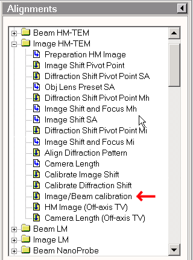

### Purpose

allow image shift without moving the beam and *vice versa*.

### Procedure

1.  From TUI Workset look for Alignment tools and start Image/Beam calibration located inside Image HM-TEM. Follow its instruction for the calibration.

