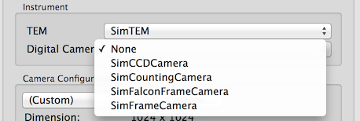

Instrument Selection Panel is used to choose the TEM and Digital Camera used for imaging. It can be found in Settings Dialog of nodes with direct control such as Correction Node, as well as Edit Preset Dialog in Presets Manager.

Note that there is always a selection of "None" to fill in the void during gui initialization and it should not be selected.

[Camera Configuration >](/leginon/Leginon_Manual/Instrument_Usage_Specifics/Instrument_Selection/Camera_Configuration)
