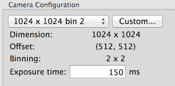

Basic camera configuration includes image dimension, offset, binning, and exposure time.

The dimension refers to the final image dimension after binning. The first axis is number of columns
The offset is calculated after binning as well and refers to the offset of the image origin relative to the origin (at top-left corner) or the camera.

Therefore, for a 4096 x 4096 camera, Centered 1024 x 1024 bin 1 with (1536,1536) offset image covers the same area as the one at centered 515 x 512 bin 2 with (768,768) offset.

Ignore settings in [Saving frames from direct detectors](/leginon/Leginon_Manual/Instrument_Usage_Specifics/Instrument_Selection/Camera_Configuration/Saving_frames_from_direct_detectors) if the camera does not have such a function

[< Instrument Selection GUI](/leginon/Leginon_Manual/Instrument_Usage_Specifics/Instrument_Selection) | [Frame Saving Configuration GUI >](/leginon/Leginon_Manual/Instrument_Usage_Specifics/Instrument_Selection/Camera_Configuration/Saving_frames_from_direct_detectors)
